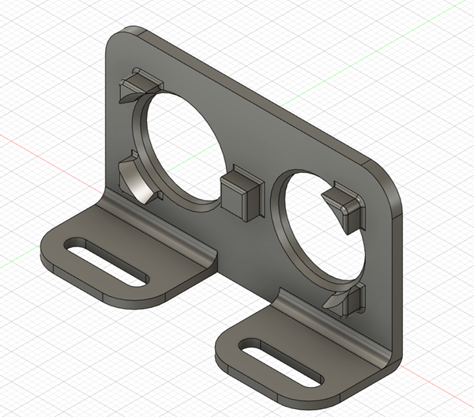

# RoboSort: Advanced Automated Waste Segregation with AI Vision & LIDAR

[](https://opensource.org/licenses/MIT)
[](https://www.python.org/)
[](https://www.arduino.cc/)
[](https://ultralytics.com/)
[](https://www.raspberrypi.org/)

## Overview
RoboSort is an intelligent automated waste segregation system designed to efficiently separate paper and plastic waste materials using a robotic arm, stepper motor positioning, and cutting-edge AI technology. The project addresses the growing need for automated waste management by combining computer vision, robotics, embedded systems, and LIDAR sensing to accurately identify and sort recyclable materials.

Integrating both Arduino and Raspberry Pi platforms, RoboSort combines mechanical, electrical, and software components for a robust, scalable solution suitable for educational institutions, recycling facilities, and smart waste management applications. The system now features advanced YOLO-based object detection and 360° LIDAR environmental awareness for enhanced sorting accuracy and safety.

## Table of Contents
- [Overview](#overview)
- [Architecture](#architecture)
- [System Diagrams](#system-diagrams)
- [Serial Communication Protocol](#serial-communication-protocol)
- [Features](#features)
- [Hardware Requirements](#hardware-requirements)
- [Software Components](#software-components)
- [Installation](#installation)
- [Usage](#usage)
- [Wiring Diagram](#wiring-diagram)
- [Hardware Models](#hardware-models)
- [Project Structure](#project-structure)
- [AI Vision System Configuration](#ai-vision-system-configuration)
- [Configuration](#configuration)
- [System Integration](#system-integration)
- [Diagrams Folder](#diagrams-folder)
- [Development](#development)
- [Contributing](#contributing)
- [License](#license)
- [Contact](#contact)

## Architecture
The system follows a modular, three-tier architecture:
- **Low-level control**: Arduino microcontroller manages real-time servo operations, motor control, and hardware interfacing
- **High-level logic**: Raspberry Pi handles vision processing, material classification (paper vs plastic), decision-making, and network communication
- **AI Vision & Sensing**: Advanced YOLO object detection with LIDAR environmental awareness for precise material identification and obstacle avoidance
- **Communication**: Serial protocol enables bidirectional data exchange between Arduino and Raspberry Pi for coordinated waste sorting operations

## System Diagrams

### Architecture Overview
```
┌─────────────────┐    ┌─────────────────┐    ┌─────────────────┐
│   Raspberry Pi  │    │   Arduino Mega  │    │   Hardware      │
│   (High-Level)  │◄──►│   (Low-Level)   │◄──►│   Components    │
│                 │    │                 │    │                 │
│ • AI Vision     │    │ • Servo Control │    │ • Robotic Arm   │
│ • YOLO Detect   │    │ • Stepper Motor │    │ • Servos        │
│ • LIDAR Process │    │ • Sensor Read   │    │ • Stepper Motor │
│ • Decision      │    │ • Serial Comm   │    │ • LIDAR Sensor  │
│ • Coordination  │    │                 │    │ • Ultrasonic    │
└─────────────────┘    └─────────────────┘    └─────────────────┘
         │                        │                        │
         └────────────────────────┼────────────────────────┘
                                  │
                    ┌─────────────┴─────────────┐
                    │     Serial USB (9600)     │
                    │   Bidirectional Protocol  │
                    └───────────────────────────┘
```

### AI Vision Processing Flow
```
┌─────────────┐    ┌─────────────┐    ┌─────────────┐
│   Camera    │───►│   YOLO      │───►│   Object    │
│   Input     │    │   Detection │    │   Detection │
└─────────────┘    └─────────────┘    └─────────────┘
       │                   │                   │
       ▼                   ▼                   ▼
┌─────────────┐    ┌─────────────┐    ┌─────────────┐
│   Frame     │───►│   Inference │───►│   Results   │
│   Capture   │    │   Engine    │    │   Analysis  │
└─────────────┘    └─────────────┘    └─────────────┘
                                                       │
                                                       ▼
┌─────────────┐    ┌─────────────┐    ┌─────────────┐
│   LIDAR     │───►│   Distance  │───►│   Overlay   │
│   Data      │    │   Fusion    │    │   Display   │
└─────────────┘    └─────────────┘    └─────────────┘
```

### Serial Communication Sequence
```
Raspberry Pi                    Arduino Mega
     │                              │
     │  1. Connect USB Cable       │
     │────────────────────────────►│
     │                              │
     │  2. Serial Port Detect       │
     │     (/dev/ttyACM0)           │
     │                              │
     │  3. Open Serial (9600)       │
     │────────────────────────────►│
     │                              │
     │  4. Arduino Reset/Ready      │
     │◄─────────────────────────────│
     │                              │
     │  5. Send Command             │
     │     "S0 90\n"                │
     │────────────────────────────►│
     │                              │
     │  6. Process Command          │
     │                              │
     │  7. Execute Action           │
     │                              │
     │  8. Send Response            │
     │     "OK\n"                   │
     │◄─────────────────────────────│
     │                              │
     │  9. Continue...              │
     │                              │
```

### Hardware Component Layout
```
┌─────────────────────────────────────────────────────────────┐
│                    RoboSort System Layout                   │
├─────────────────────────────────────────────────────────────┤
│  ┌─────────────┐    ┌─────────────┐    ┌─────────────┐      │
│  │  Raspberry  │    │   Arduino   │    │   LIDAR     │      │
│  │     Pi      │    │    Mega     │    │    LD06     │      │
│  │             │    │             │    │             │      │
│  │ • USB Cam   │    │ • Servo PWM │    │ • 360° Scan │      │
│  │ • AI Vision │    │ • Stepper   │    │ • Distance   │      │
│  │ • Control   │    │ • Sensors   │    │ • Serial     │      │
│  └─────────────┘    └─────────────┘    └─────────────┘      │
│           │                   │                   │         │
│           └─────────┬─────────┼─────────┬─────────┘         │
│                     │         │         │                   │
│  ┌─────────────┐    │    ┌─────────────┐    │    ┌─────────┐ │
│  │  Stepper    │◄───┘    │   Robotic    │◄───┘    │  Power  │ │
│  │   Driver    │         │     Arm      │         │ Supply  │ │
│  │  (A4988)    │         │   (5-DOF)    │         │         │ │
│  │             │         │ • Servos     │         │ • 5V    │ │
│  │ • STEP/DIR  │         │ • Gripper    │         │ • 12V   │ │
│  │ • Current   │         │              │         │ • GND   │ │
│  └─────────────┘         └─────────────┘         └─────────┘ │
│                                                                     │
│  ┌─────────────┐    ┌─────────────┐    ┌─────────────┐              │
│  │ Ultrasonic  │    │   Waste     │    │   Sorted    │              │
│  │  Sensor     │    │  Input      │    │   Bins      │              │
│  │  HC-SR04    │    │   Area      │    │             │              │
│  │             │    │             │    │ • Paper     │              │
│  │ • Distance  │    │ • Detection │    │ • Plastic   │              │
│  │ • Trigger   │    │ • Position  │    │ • Other     │              │
│  └─────────────┘    └─────────────┘    └─────────────┘              │
└─────────────────────────────────────────────────────────────────────┘
```

### Software Workflow
```
┌─────────────┐
│   Start     │
└──────┬──────┘
       │
       ▼
┌─────────────┐     ┌─────────────┐
│ Initialize  │────►│   Camera    │
│ Components  │     │   Setup     │
└──────┬──────┘     └──────┬──────┘
       │                   │
       ▼                   ▼
┌─────────────┐     ┌─────────────┐
│ Serial USB  │     │   LIDAR     │
│ Connection  │     │   Setup     │
└──────┬──────┘     └──────┬──────┘
       │                   │
       └──────┬────────────┘
              │
              ▼
┌─────────────────────────────┐
│        Main Loop            │
├─────────────────────────────┤
│  ┌─────────────┐            │
│  │  Capture    │            │
│  │   Frame     │            │
│  └──────┬──────┘            │
│         │                   │
│         ▼                   │
│  ┌─────────────┐            │
│  │   YOLO      │            │
│  │ Detection   │            │
│  └──────┬──────┘            │
│         │                   │
│         ▼                   │
│  ┌─────────────┐            │
│  │   LIDAR     │            │
│  │   Fusion    │            │
│  └──────┬──────┘            │
│         │                   │
│         ▼                   │
│  ┌─────────────┐            │
│  │   Decision  │            │
│  │   Making    │            │
│  └──────┬──────┘            │
│         │                   │
│         ▼                   │
│  ┌─────────────┐            │
│  │   Serial    │            │
│  │   Command   │            │
│  └──────┬──────┘            │
│         │                   │
│         ▼                   │
│  ┌─────────────┐            │
│  │   Robotic   │            │
│  │   Action    │            │
│  └──────┬──────┘            │
│         │                   │
└─────────┼───────────────────┘
          │
          ▼
┌─────────────┐     ┌─────────────┐
│   Display   │◄────┤   Continue  │
│   Results   │     │    Loop     │
└──────┬──────┘     └──────┬──────┘
       │                   │
       └─────────┬─────────┘
                 │
                 ▼
          ┌─────────────┐
          │    Exit     │
          │  (q/Q key)  │
          └─────────────┘
```

### Command Processing Flow
```
User Input / Auto Detection
           │
           ▼
    ┌─────────────┐
    │  Command    │
    │  Parser     │
    └──────┬──────┘
           │
           ▼
    ┌─────────────┐     ┌─────────────┐
    │   Servo     │     │  Stepper    │
    │ Commands    │     │ Commands    │
    │ (S<id><ang>)│     │ (STEP<steps>)│
    └──────┬──────┘     └──────┬──────┘
           │                   │
           └──────┬────────────┘
                  │
                  ▼
           ┌─────────────┐
           │   Serial    │
           │   Send      │
           │  (9600bps)  │
           └──────┬──────┘
                  │
                  ▼
           ┌─────────────┐
           │   Arduino   │
           │   Process   │
           └──────┬──────┘
                  │
                  ▼
           ┌─────────────┐
           │   Hardware  │
           │   Control   │
           └──────┬──────┘
                  │
                  ▼
           ┌─────────────┐
           │   Response  │
           │   Return    │
           └─────────────┘
```

### Error Handling Flow
```
┌─────────────┐
│   Error     │
│  Detected   │
└──────┬──────┘
       │
       ▼
┌─────────────┐     ┌─────────────┐
│   Log       │     │   Check     │
│   Error     │     │   Type      │
└──────┬──────┘     └──────┬──────┘
       │                   │
       ▼                   ▼
┌─────────────┐     ┌─────────────┐
│   Serial    │     │   Camera    │
│   Timeout   │     │   Error     │
└──────┬──────┘     └──────┬──────┘
       │                   │
       ▼                   ▼
┌─────────────┐     ┌─────────────┐
│   Retry     │     │   Reconnect │
│ Connection  │     │   Camera    │
└──────┬──────┘     └──────┬──────┘
       │                   │
       └──────┬────────────┘
              │
              ▼
       ┌─────────────┐
       │   Continue  │
       │   Operation │
       └─────────────┘
```

### Data Flow Architecture
```
Input Sources
├── Camera Stream
│   ├── USB Camera
│   ├── Pi Camera
│   └── Video Files
├── LIDAR Sensor
│   ├── LD06 360°
│   └── Serial Data
└── User Commands
    ├── Keyboard
    ├── Serial Input
    └── Auto Triggers

Processing Pipeline
├── Frame Capture
│   ├── OpenCV
│   └── Real-time
├── AI Detection
│   ├── YOLO Model
│   ├── Inference
│   └── Post-processing
├── Sensor Fusion
│   ├── Distance Data
│   ├── Object Tracking
│   └── Safety Checks
└── Decision Engine
    ├── Sorting Logic
    ├── Command Generation
    └── Priority Handling

Output Destinations
├── Display Overlay
│   ├── Bounding Boxes
│   ├── Distance Info
│   └── FPS Counter
├── Serial Commands
│   ├── Arduino Control
│   └── Hardware Actions
└── Logging System
    ├── Performance
    ├── Errors
    └── Statistics
```

## Serial Communication Protocol

### Raspberry Pi ↔ Arduino Mega USB Communication

The system uses serial communication over USB cable for bidirectional data exchange between the Raspberry Pi (high-level logic) and Arduino Mega (low-level control). This architecture provides reliable, real-time control of robotic components.

#### Technical Specifications
- **Interface**: USB Serial (Virtual COM Port)
- **Baud Rate**: 9600 bps
- **Data Bits**: 8
- **Parity**: None
- **Stop Bits**: 1
- **Flow Control**: None
- **Protocol**: ASCII text commands with newline termination

#### Connection Setup
1. **Hardware Connection**: Connect Arduino Mega to Raspberry Pi USB port using USB cable
2. **Port Identification**:
   - Linux/Raspberry Pi: `/dev/ttyACM0` or `/dev/ttyUSB0`
   - Windows: `COM3`, `COM4`, etc.
3. **Permissions**: Add user to `dialout` group for serial access
   ```bash
   sudo usermod -a -G dialout $USER
   ```

#### Communication Flow
```
Raspberry Pi (Python) → Serial USB → Arduino Mega → Hardware Control
Raspberry Pi (Python) ← Serial USB ← Arduino Mega ← Sensor Feedback
```

#### Command Format
- **Commands**: ASCII text strings ending with newline (`\n`)
- **Response**: Immediate acknowledgment or data return
- **Timeout**: 1 second read timeout
- **Error Handling**: Automatic reconnection on communication failure

## Features
- **🤖 Five degrees of freedom (5-DOF) robotic arm** for precise waste material handling
- **🧠 Advanced AI Vision**: YOLO-based object detection and classification for accurate material identification
- **📡 LIDAR Integration**: 360° environmental awareness with LD06 LIDAR sensor support
- **🔄 Automated paper and plastic waste identification** and segregation with real-time confidence scoring
- **⚙️ Stepper Motor Control**: Precise positioning for robotic arm movement using stepper motor drivers
- **🎯 16-channel PWM servo driver (PCA9685)** for coordinated multi-servo control
- **📹 Multiple Camera Support**: USB cameras, Raspberry Pi Camera, and video file processing
- **🎥 Real-time Video Processing**: Live object detection with overlay information and recording capabilities
- **📊 Distance-Aware Detection**: LIDAR distance measurements integrated with visual detection results
- **🛡️ Collision Avoidance**: 360° obstacle detection for safe robotic operation
- **📈 Performance Monitoring**: Real-time FPS tracking and object counting
- **🔧 Modular design** with clear separation between control (Arduino) and high-level logic (Raspberry Pi)
- **💻 Serial command interface** for manual testing and calibration
- **📱 Expandable architecture** for additional sensors or actuators
- **📚 Comprehensive documentation** and model images for easy assembly and understanding

## Hardware Requirements

### Main Body Dimensions
- Height: 4 inches
- Length: 35 inches
- Width: 20 inches

### Trash Bin Dimensions
- Height: 20 inches
- Radius: 10 inches (Diameter: 20 inches)

### Components
- **Robotic Arm**: 5-DOF articulated arm
- **Servos**: 5 standard servos (SG90/MG996R or similar)
- **Servo Driver**: Adafruit 16-channel PWM Servo Driver (PCA9685)
  - I2C interface requiring only 2 pins (SDA, SCL)
  - 12-bit resolution PWM output
  - Adjustable frequency up to 1.6 kHz
  - Chainable up to 62 boards (992 servos total)
  - I2C address: 0x40-0x7F (selectable via solder jumpers)
  - 5V tolerant logic (works with 3.3V or 5V systems)
  - Built-in clock for free-running PWM (no continuous signal needed)
- **Stepper Motor Driver**: Stepper motor driver for precise positioning (e.g., A4988, DRV8825)
- **Stepper Motors**: NEMA stepper motors for robotic arm positioning and movement
- **LIDAR Sensors**:
  - **LDRobot LD06**: 360° scanning LIDAR (0.02-12m range, 4500Hz sample rate)
- **Camera Systems**:
  - USB webcam or Raspberry Pi Camera for object detection
  - Support for multiple resolutions and video formats
- **Microcontroller**: Arduino-compatible board (Uno, Mega, etc.)
- **Single-board Computer**: Raspberry Pi (any model with GPIO, recommended 4B+ for AI processing)
- **Power Supply**: Adequate power for servos, stepper motors, LIDAR, and logic circuits (recommend separate power for motors)

## Software Components

### Arduino Firmware
- **RoboSort.ino**: Main firmware integrating servo and motor control with serial command interface
- **SERVO_CONFIG.h**: Header file with servo configuration and function declarations
- **SERVO_CONFIG.cpp**: Implementation of servo control logic and movement functions
- **STEPPER_CONFIG.h**: Header file for stepper motor driver configuration and control declarations
- **STEPPER_CONFIG.cpp**: Implementation of stepper motor control logic for precise positioning

### Raspberry Pi Software
- **RoboSort.py**: Main application with interactive command-line interface for testing and controlling the robot
- **serial_config.py**: Modular serial communication handler for Arduino-Raspberry Pi USB communication
- **yolo_detect.py**: Advanced AI vision system with YOLO object detection and LIDAR integration
- **requirements.txt**: Python package dependencies

### AI Vision System (yolo_detect.py)
The YOLO detection system provides advanced computer vision capabilities:

#### Core Features
- **Multi-Source Input**: Support for USB cameras, Raspberry Pi Camera, video files, images, and image folders
- **Real-time Object Detection**: YOLO-based classification with confidence scoring
- **LIDAR Integration**: Distance measurement overlay on detected objects
- **360° Environmental Awareness**: Full point cloud data from LD06 LIDAR
- **Performance Monitoring**: FPS tracking and object counting
- **Recording Capabilities**: Save detection results as video files

#### Supported LIDAR Sensors
- **LD06 (LDRobot)**: 360° scanning LIDAR with 0.02-12m range

#### Command Line Interface
```bash
# Basic YOLO detection
python yolo_detect.py --model model.pt --source usb0 --resolution 640x480

# With LD06 LIDAR integration
python yolo_detect.py --model model.pt --source usb0 --lidar /dev/ttyUSB0 --lidar-type ld06

# With TFMini LIDAR
python yolo_detect.py --model model.pt --source usb0 --lidar COM3 --lidar-type tfmini

# Record results
python yolo_detect.py --model model.pt --source usb0 --record --resolution 640x480
```

### Serial Commands

#### Servo Commands
- `TEST`: Runs a test sequence on all servos
- `S<servo> <angle>`: Sets a specific servo (0-4) to a given angle (0-180)
  - Example: `S2 90` - Set servo 2 to 90 degrees

#### Stepper Motor Commands
- `STEPPER_TEST`: Runs a comprehensive test sequence on the stepper motor
- `STEP <steps> <direction> <speed>`: Moves stepper motor with specified parameters
  - Steps: Number of steps to move (1-10000)
  - Direction: `CW` (clockwise) or `CCW` (counter-clockwise)
  - Speed: Steps per second (1-1000)
  - Example: `STEP 200 CW 500` - Move 200 steps clockwise at 500 steps/sec
- `STEPPER_HOME`: Homes the stepper motor to zero position
- `STEPPER_STOP`: Immediately stops stepper motor movement

#### Ultrasonic Commands
- `UTEST`: Runs comprehensive ultrasonic sensor test with multiple readings
- `UDIST`: Gets single distance measurement in centimeters
- `UAVG <samples>`: Gets average distance from multiple samples (1-10)
  - Example: `UAVG 5` - Average of 5 distance samples
- `UDETECT <threshold>`: Detects if object is within threshold distance (1-400 cm)
  - Example: `UDETECT 30` - Detect objects within 30 cm

## Installation

### Arduino Setup
1. Install the Arduino IDE from [arduino.cc](https://www.arduino.cc)
2. Install the Adafruit PWM Servo Driver library:
   - Open Arduino IDE
   - Go to Tools > Manage Libraries
   - Search for "Adafruit PWM Servo Driver"
   - Install the library
3. Open `source/arduino/RoboSort/RoboSort.ino`
4. Select your board and port from the Tools menu
5. Upload the firmware to your Arduino

### Raspberry Pi Setup
1. Ensure Python 3.x is installed (pre-installed on Raspberry Pi OS)
2. Navigate to `source/rpi/RoboSort/`
3. Install required Python packages:
   ```bash
   pip install -r requirements.txt
   ```
   Or install packages individually:
   ```bash
   pip install pyserial ultralytics opencv-python numpy
   ```
4. **For LIDAR Support** (optional, install as needed):
   ```bash
   # For LD06 serial LIDAR (pyserial already included)
   # No additional packages needed
   ```
5. Configure serial port permissions:
   ```bash
   sudo usermod -a -G dialout $USER
   ```
   Then logout and login again for changes to take effect
6. **Serial Communication Setup**:
   - Connect Arduino Mega to Raspberry Pi via USB cable
   - The Arduino will appear as a serial device (typically `/dev/ttyACM0`)
   - Baud rate: 9600 (automatically configured)
   - Test connection:
   ```bash
   ls /dev/ttyACM* /dev/ttyUSB*
   ```
7. Run the Python application:
   ```bash
   python3 RoboSort.py
   ```

### YOLO Model Setup
1. Download or train a YOLO model for waste classification
2. Place the model file (`.pt` format) in the `source/rpi/RoboSort/` directory
3. Supported models: YOLOv8, YOLOv9, YOLOv10, or custom trained models

### LIDAR Sensor Setup
1. **LD06 Setup**:
   - Connect to USB port (appears as `/dev/ttyUSB0` on Linux or `COM3` on Windows)
   - Baudrate: 230400
   - No additional configuration needed

## Usage

### AI Vision System (YOLO Detection)

The `yolo_detect.py` script provides advanced object detection and LIDAR integration capabilities:

#### Basic Usage
```bash
# Detect objects from USB camera
python yolo_detect.py --model yolov8n.pt --source usb0

# Detect from Raspberry Pi Camera
python yolo_detect.py --model yolov8n.pt --source picamera0 --resolution 640x480

# Process video file
python yolo_detect.py --model yolov8n.pt --source video.mp4

# Process single image
python yolo_detect.py --model yolov8n.pt --source image.jpg

# Process image folder
python yolo_detect.py --model yolov8n.pt --source images/
```

#### LIDAR Integration
```bash
# LD06 360° LIDAR (recommended for full environmental awareness)
python yolo_detect.py --model yolov8n.pt --source usb0 --lidar /dev/ttyUSB0 --lidar-type ld06
```

#### Advanced Options
```bash
# Custom confidence threshold
python yolo_detect.py --model yolov8n.pt --source usb0 --thresh 0.3

# Record detection results
python yolo_detect.py --model yolov8n.pt --source usb0 --record --resolution 640x480

# Custom display resolution
python yolo_detect.py --model yolov8n.pt --source usb0 --resolution 1280x720
```

#### Visual Output Features
- **Real-time Detection**: Bounding boxes with class labels and confidence scores
- **LIDAR Overlay**: Distance measurements displayed on screen and in detection labels
- **Performance Metrics**: FPS counter and object counting
- **360° Awareness**: LD06 provides closest obstacle distance from any direction
- **Safety Monitoring**: Forward distance for collision avoidance

#### Keyboard Controls
- **'q' or 'Q'**: Quit the application
- **'s' or 'S'**: Pause/resume detection
- **'p' or 'P'**: Save current frame as screenshot

### Raspberry Pi Interactive Control
The RoboSort.py application provides a menu-driven interface for controlling the system:

```bash
python3 RoboSort.py
```

**Menu Options:**
1. Test all servos
2. Set specific servo angle
3. Test stepper motor
4. Control stepper motor movement
5. Home stepper motor
6. Stop stepper motor
7. Test ultrasonic sensor
8. Get distance measurement
9. Detect object (with threshold)
10. Send custom command
0. Exit

**Python Module Usage Example:**
```python
from serial_config import SerialConfig

# Using context manager (automatic connection/disconnection)
with SerialConfig(port='/dev/ttyACM0') as serial_conn:
    # Test components
    serial_conn.test_servos()
    serial_conn.get_distance()

    # Control servo
    serial_conn.set_servo(0, 90)

    # Control stepper motor
    serial_conn.stepper_move(200, 'CW', 500)  # Move 200 steps clockwise at 500 steps/sec

    # Home stepper motor
    serial_conn.stepper_home()

    # Stop stepper motor
    serial_conn.stepper_stop()
```

### Arduino Serial Monitor Testing

**Basic Operation:**
1. Connect Arduino to computer via USB
2. Open Arduino IDE Serial Monitor (9600 baud)
3. Send commands directly to test components

**Testing Servos:**
```
TEST
```
Runs a test sequence on all servos, moving each through its full range of motion.

**Manual Servo Control:**
```
S0 90
S1 45
S2 180
```
Set servo 0 to 90 degrees, servo 1 to 45 degrees, and servo 2 to 180 degrees.

**Testing Stepper Motor:**
```
STEPPER_TEST
```
Runs a comprehensive test sequence on the stepper motor.

**Manual Stepper Motor Control:**
```
STEP 200 CW 500
STEP 200 CCW 500
STEPPER_HOME
STEPPER_STOP
```
Move 200 steps clockwise at 500 steps/sec, move 200 steps counter-clockwise at 500 steps/sec, home the motor, and stop the motor.

**Testing Ultrasonic Sensor:**
```
UTEST
UDIST
UAVG 5
UDETECT 30
```
Run sensor test, get single distance, get average of 5 samples, detect object within 30 cm.

## Wiring Diagram

### System Wiring Schematic


The wiring diagram shows the complete electrical connections for the RoboSort system. All components are connected to the Arduino Mega 2560 microcontroller, which serves as the central control unit. The Arduino communicates with the Raspberry Pi via USB serial connection for coordinated control.

#### System Communication:
**Arduino Mega ↔ Raspberry Pi Serial USB**
- **USB Cable**: Standard USB A-to-B cable (Arduino Mega uses USB-B connector)
- **Serial Port**: Appears as `/dev/ttyACM0` on Raspberry Pi
- **Baud Rate**: 9600 bps
- **Protocol**: ASCII command/response over virtual serial port

#### Component Connections:

**1. Adafruit PCA9685 16-Channel PWM Servo Driver**
- **VCC** → Arduino 5V
- **GND** → Arduino GND
- **SDA** → Arduino Pin 20 (SDA)
- **SCL** → Arduino Pin 21 (SCL)
- **V+** → External 5V Power Supply (for servos)
- **GND** → Common Ground with external power
- **Servo Outputs** → 5 Servos connected to channels 0-4

**2. Stepper Motor Driver (A4988/DRV8825)**
- **Control Pins:**
  - STEP → Arduino Pin 9 (pulse for each step)
  - DIR → Arduino Pin 8 (direction control)
  - EN → Arduino Pin 7 (enable/disable, optional)
  - MS1-MS3 → Arduino Pins 6, 5, 4 (microstepping, optional)
- **Power:**
  - VMOT → Motor power supply (8-35V depending on driver)
  - GND → Common ground with Arduino
  - VDD → Logic power (3.3-5V from Arduino)
- **Motor Connections:**
  - A1/A2/B1/B2 → Stepper motor coils (check motor datasheet for wiring)

**3. HC-SR04 Ultrasonic Sensor**
- **VCC** → Arduino 5V
- **GND** → Arduino GND
- **TRIG** → Arduino Pin 4
- **ECHO** → Arduino Pin 5

**4. Power Supply Configuration**
- **Arduino Power:** USB connection from Raspberry Pi or 7-12V DC adapter
- **Servo Power:** Separate 5V power supply (recommended 5V 5A for multiple servos)
- **Stepper Motor Power:** Separate power supply (8-35V depending on motor/driver)
- **Common Ground:** All grounds must be connected together

#### Important Notes:
- Always use separate power supplies for stepper motors and servos to prevent voltage drops
- Ensure proper stepper motor coil wiring (check motor datasheet)
- Set appropriate current limiting on stepper driver to prevent overheating
- Use shielded cables for STEP and DIR signals if experiencing interference
- Ensure all grounds are connected together (common ground)
- The Fritzing source file (`Wiring.fzz`) is available in the `diagram/` folder for editing
- Verify all connections before powering on the system
- Use appropriate wire gauges for motor connections (minimum 22 AWG)

## Hardware Models

### Front View


The front view shows the main interface and access points of the RoboSort system, including the entry slot for sorting and the control panel.

### Side View


The side view highlights the internal mechanism layout, conveyor system, and the relative position of the trash bin to the sorting area.

### Main/Top View


The main/top view provides a comprehensive look at the overall structure, showing the arrangement of components and the spatial relationship between the body and the trash bin.

### RoboSort Lidar Mount


**Description:**
The RoboSort Lidar Mount is a custom-designed 3D-printed bracket specifically engineered to securely hold the LD06 360° LIDAR sensor on the RoboSort platform. This mount ensures optimal sensor alignment and vibration isolation, which are critical for accurate distance measurements and reliable 360° environmental scanning.

**Key Features:**
- **Precision Fit:** Designed to match the LD06 LIDAR's mounting holes and base diameter for a snug, secure fit.
- **Vibration Dampening:** Includes anti-vibration pads or mounting holes for rubber grommets to minimize sensor noise.
- **Cable Management:** Integrated channels or clips for neat routing of power and data cables.
- **Adjustable Height:** Allows fine-tuning of the LIDAR's elevation for best field of view and obstacle clearance.
- **Material:** Recommended to print in PETG or ABS for strength and heat resistance.
- **Mounting:** Attaches to the main platform using M3 screws and heat-set inserts for robust, repeatable installation.

**Usage:**
- Place the LD06 LIDAR into the mount, align the holes, and secure with screws.
- Route the cables through the provided channels to prevent tangling or snagging during arm movement.
- The mount is positioned to provide a clear 360° scan without obstruction from the robotic arm or bins.

**3D Model File:**
- The STL file for the Lidar Mount (`RoboSort_Lidar_Mount.stl`) is available in the `model/` directory (ignored by git, but the image is shown here for reference).

**Preview:**


**Section Reference:** See also the [3D Model Documentation](diagrams/3d_model_specification.md) for technical details and print settings.

---

### RoboSort Limit Switch Mount


**Description:**
The RoboSort Limit Switch Mount is a custom-designed 3D-printed bracket engineered to securely hold limit switches (end-stop sensors) on the RoboSort platform. This mount provides precise positioning for homing and boundary detection in stepper motor systems, ensuring accurate and safe robotic movement.

**Key Features:**
- **Precision Alignment:** Designed with adjustable slots or holes for fine-tuning switch position and activation point.
- **Secure Mounting:** Includes mounting holes for M3 screws and heat-set inserts for robust attachment to the frame.
- **Cable Management:** Integrated channels or clips for organizing switch wiring and preventing cable strain.
- **Universal Compatibility:** Supports standard microswitches or optical limit switches commonly used in robotics.
- **Material:** Recommended to print in PETG or ABS for durability and dimensional stability.
- **Adjustable Trigger:** Allows precise adjustment of the switch activation distance for optimal performance.

**Usage:**
- Mount the limit switch into the bracket and secure with screws.
- Position the mount at the desired end-stop location on the linear rail or stepper motor axis.
- Adjust the switch position to trigger at the correct boundary point.
- Connect the switch to the Arduino for homing and safety limit detection.

**3D Model File:**
- The STL file for the Limit Switch Mount (`RoboSort_Limit_Switch_Mount.stl`) is available in the `model/` directory (ignored by git, but the image is shown here for reference).

**Preview:**


**Section Reference:** See also the [3D Model Documentation](diagrams/3d_model_specification.md) for technical details and print settings.

---

### RoboSort Plate Holder


**Description:**
The RoboSort Plate Holder is a custom-designed 3D-printed bracket specifically engineered to securely hold sorting plates or trays on the RoboSort platform. This holder ensures stable positioning of waste materials during the sorting process, preventing slippage and ensuring accurate robotic arm pickup.

**Key Features:**
- **Secure Grip:** Designed with retention features or clamps to hold plates firmly in place.
- **Adjustable Positioning:** Includes slots or holes for fine-tuning plate alignment and height.
- **Vibration Resistance:** Features anti-slip surfaces or rubber inserts to minimize plate movement during operation.
- **Modular Design:** Allows for easy removal and replacement of plates for different sorting scenarios.
- **Material:** Recommended to print in PETG or ABS for strength and wear resistance.
- **Mounting:** Attaches to the main platform using M3 screws and heat-set inserts for stable installation.

**Usage:**
- Place the sorting plate into the holder and secure if necessary.
- Mount the holder on the designated platform area for material staging.
- Ensure the plate is level and properly aligned for robotic arm access.
- The holder maintains plate position during the entire sorting cycle.

**3D Model File:**
- The STL file for the Plate Holder (`RoboSort_Plate_Holder.stl`) is available in the `model/` directory (ignored by git, but the image is shown here for reference).

**Preview:**


**Section Reference:** See also the [3D Model Documentation](diagrams/3d_model_specification.md) for technical details and print settings.

---

### Ultrasonic Sensor Holder



The Ultrasonic Sensor Holder is based on the HC-SR04 Ultrasonic Sensor Holder from Thingiverse ([Thingiverse Link](https://www.thingiverse.com/thing:1170335)). It's a 3D-printed bracket designed to mount an HC-SR04 or similar sensor to the RoboSort frame. It provides a secure, angled position for optimal distance measurement and easy wiring access.

**3D Model File:** `Ultrasonic_Sensor_Holder.stl` (not tracked in git, image shown for reference).

---

## Project Structure
```
robo-sort/
├── LICENSE
├── README.md
├── yolo_detect.py                    # AI Vision System with YOLO & LIDAR
├── diagram/                         # Circuit diagrams and schematics
│   ├── Wiring.fzz                   # Fritzing wiring diagram (editable)
│   └── Wiring.png                   # Wiring diagram image
├── model/                           # 3D models and images
│   ├── robosort-front.jpg
│   ├── robosort-main.jpg
│   └── robosort-side.jpg
└── source/
    ├── arduino/
    │   └── RoboSort/
    │       ├── RoboSort.ino              # Main firmware with integrated control
    │       ├── SERVO_CONFIG.h            # Servo driver header
    │       ├── SERVO_CONFIG.cpp          # Servo driver implementation
    │       ├── STEPPER_CONFIG.h          # Stepper motor driver header
    │       ├── STEPPER_CONFIG.cpp        # Stepper motor driver implementation
    │       ├── ULTRASONIC_CONFIG.h       # Ultrasonic sensor header
    │       └── ULTRASONIC_CONFIG.cpp     # Ultrasonic sensor implementation
    └── rpi/
        └── RoboSort/
            ├── RoboSort.py               # Main application with CLI interface
            ├── serial_config.py          # Serial communication module
            ├── yolo_detect.py            # AI Vision System (duplicate for easy access)
            └── requirements.txt          # Python dependencies
```

## AI Vision System Configuration

### YOLO Model Training
For optimal waste classification performance, train a custom YOLO model:

1. **Collect Dataset**: Gather images of paper and plastic waste materials
2. **Label Images**: Use tools like LabelImg or Roboflow to annotate objects
3. **Train Model**: Use Ultralytics YOLOv8 for training:
   ```bash
   pip install ultralytics
   yolo train data=waste_dataset.yaml model=yolov8n.pt epochs=100
   ```
4. **Export Model**: Convert to deployment format:
   ```bash
   yolo export model=runs/detect/train/weights/best.pt format=onnx
   ```

### LIDAR Sensor Calibration
- **LD06**: No calibration needed, factory calibrated

### Performance Optimization
- Use Raspberry Pi 4B+ or higher for best AI performance
- Enable GPU acceleration if available (NVIDIA Jetson)
- Adjust confidence threshold based on lighting conditions
- Use appropriate camera resolution for your use case

#### Technical Specifications
- **Chip**: NXP PCA9685 PWM controller
- **Resolution**: 12-bit (4096 steps)
- **PWM Frequency**: Adjustable from ~40Hz to ~1600Hz (typically 50Hz for servos)
- **Channels**: 16 independent PWM outputs
- **Interface**: I2C (uses only 2 pins: SDA and SCL)
- **Default I2C Address**: 0x40 (changeable via solder jumpers A0-A5)
- **Address Range**: 0x40 to 0x7F (allows up to 62 boards on one I2C bus)
- **Logic Level**: 5V tolerant I2C (works with 3.3V or 5V microcontrollers)
- **Power**: Separate power input for servos (up to 6V recommended)
- **Dimensions**: 2.5" x 1" x 0.1" (62.5mm x 25.4mm x 3mm)

#### Key Features
- **Free-Running PWM**: Built-in clock means no continuous signal needed from Arduino
- **Zero Processing Overhead**: Runs independently after initial setup
- **Chainable**: Control up to 992 servos using 62 boards with only 2 pins
- **Output Protection**: 220Ω series resistors on all outputs
- **Reverse Polarity Protection**: Built-in on terminal block
- **Configurable Output**: Push-pull or open-drain mode

#### Wiring Guide
**I2C Connections (Required):**
- SDA → Arduino A4 (Uno/Nano) or Pin 20 (Mega)
- SCL → Arduino A5 (Uno/Nano) or Pin 21 (Mega)
- VCC → Arduino 5V
- GND → Arduino GND

**Servo Power (Required):**
- V+ → External power supply positive (4.8V - 6V for most servos)
- GND → External power supply ground (must share common ground with Arduino)
- Note: Do NOT power servos from Arduino's 5V pin (insufficient current)

**Servo Connections:**
- Connect servos to any of the 16 three-pin headers
- Each header provides: PWM signal, VCC, and GND
- Servos can be plugged directly into the board

#### Address Selection
By default, the board uses I2C address 0x40. To change the address:
- Solder bridge combinations of A0-A5 jumpers on the board
- Each jumper adds to the base address (0x40)
- Example: Bridging A0 sets address to 0x41

#### Library Installation
Install the Adafruit PWM Servo Driver library in Arduino IDE:
```
Tools > Manage Libraries > Search "Adafruit PWM Servo Driver" > Install
```

### Servo Calibration
Adjust the servo pulse width limits in `SERVO_CONFIG.cpp`:
```cpp
#define SERVO_MIN_PULSE  150  // Minimum pulse length (0°)
#define SERVO_MAX_PULSE  600  // Maximum pulse length (180°)
```

**Calibration Tips:**
- Standard servos typically use 150-600 pulse range (1ms-2ms)
- Fine-tune these values if servos don't reach full range or jitter at endpoints
- Test with serial commands before finalizing pulse values
- Some servos may require 120-600 or 150-650 ranges

### Servo Channel Mapping
Modify the servo channel assignments in the `ServoConfig` constructor to match your wiring configuration.

### Stepper Motor Pin Configuration
Configure stepper motor driver pin connections in `STEPPER_CONFIG.h` according to your wiring:
```cpp
#define STEPPER_STEP 9     // STEP pin for stepper motor driver
#define STEPPER_DIR 8      // DIR pin for stepper motor direction
#define STEPPER_EN 7       // ENABLE pin for stepper motor (optional)
#define STEPPER_MS1 6      // Microstepping pin 1 (optional)
#define STEPPER_MS2 5      // Microstepping pin 2 (optional)
#define STEPPER_MS3 4      // Microstepping pin 3 (optional)
```

### Stepper Motor Driver Wiring Guide
Common stepper motor drivers (A4988, DRV8825) use a standard interface:

**Control Connections:**
- STEP → Arduino digital pin (pulse for each step)
- DIR → Arduino digital pin (direction control)
- EN → Arduino digital pin (enable/disable driver)
- MS1-MS3 → Arduino digital pins (microstepping resolution)

**Motor Connections:**
- Connect stepper motor coils to A1/A2/B1/B2 terminals
- Ensure proper coil pairing (check motor datasheet)

**Power Connections:**
- VMOT → Motor power supply (8-35V depending on driver)
- GND → Common ground with Arduino
- VDD → Logic power (3.3-5V from Arduino)

**Control Connections:**
- Connect Arduino digital pins to STEP, DIR, and EN inputs
- Optional microstepping pins for finer resolution control
- Connect Arduino GND to driver GND (common ground required)

**Safety Notes:**
- Use appropriate power supply voltage for your stepper motor specifications
- Add decoupling capacitors (10-100µF) across motor power terminals
- Ensure proper current limiting on the driver to prevent motor overheating
- Keep motor power wires short and twisted to reduce noise
- Use shielded cables for STEP and DIR signals if experiencing interference

## System Integration

### Complete RoboSort Workflow
1. **Material Detection**: YOLO vision system identifies waste materials in the workspace
2. **Distance Measurement**: LIDAR ensures safe robotic approach distance
3. **Sorting Decision**: Raspberry Pi processes detection results and makes sorting decisions
4. **Robotic Action**: Arduino receives commands to actuate stepper motors and servos
5. **Material Handling**: Robotic arm picks and places materials in appropriate bins
6. **Quality Control**: System logs all actions for performance monitoring

### Safety Features
- **Collision Avoidance**: LIDAR provides 360° obstacle detection
- **Emergency Stop**: Hardware and software emergency stop capabilities
- **Fault Detection**: Automatic detection of sensor failures
- **Safe Operating Zones**: Configurable safety boundaries for robotic movement

### Performance Metrics
- **Detection Accuracy**: YOLO confidence scores for material classification
- **Processing Speed**: Real-time FPS monitoring
- **Sorting Efficiency**: Success rate tracking and optimization
- **System Reliability**: Uptime monitoring and fault detection

## Diagrams Folder

The `diagrams/` directory contains comprehensive visual documentation of the RoboSort system:

### Available Diagrams
- **`system_architecture.puml`**: PlantUML diagram showing complete system architecture and component interactions
- **`workflow_diagrams.md`**: Mermaid diagrams illustrating processing workflows, communication sequences, and state transitions
- **`pin_configuration.txt`**: Detailed ASCII diagram of Arduino Mega pin connections, wiring schematics, and troubleshooting guide
- **`README.md`**: Documentation for all diagrams with usage instructions and viewing tools

### Diagram Formats
- **PlantUML**: Professional architecture diagrams (view online at plantuml.com)
- **Mermaid**: Interactive flowcharts compatible with GitHub markdown
- **ASCII Text**: Hardware-focused diagrams for easy reference during assembly

### Key Visualizations
- System component relationships and data flow
- AI vision processing pipeline
- Serial communication protocols
- Hardware pin configurations and power distribution
- Error handling and recovery workflows
- State machine transitions

For detailed hardware assembly and system understanding, refer to the diagrams folder.

## Development

### Adding New Features
1. For hardware control: Edit Arduino files in `source/arduino/RoboSort/`
2. For high-level logic: Edit Python files in `source/rpi/RoboSort/`
3. Test thoroughly using the serial command interface

### Debugging
- Use the Arduino Serial Monitor for low-level debugging
- Add Serial.println() statements in the Arduino code
- Use Python's print() or logging module for Raspberry Pi debugging

## Contributing
Contributions are welcome! Please follow these guidelines:
1. Fork the repository
2. Create a feature branch
3. Commit your changes with clear, descriptive messages
4. Push to your fork
5. Submit a pull request

## License
This project is licensed under the MIT License. See the LICENSE file for details.

## Contact

For questions, suggestions, or contributions, feel free to reach out:

- **Email**: quezon.province.pd@gmail.com
- **GitHub**: [github.com/qppd](https://github.com/qppd)
- **Portfolio**: [sajed-mendoza.onrender.com](https://sajed-mendoza.onrender.com)
- **Facebook**: [facebook.com/qppd.dev](https://facebook.com/qppd.dev)
- **Facebook Page**: [facebook.com/QUEZONPROVINCEDEVS](https://facebook.com/QUEZONPROVINCEDEVS)