# RoboSort: Advanced Automated Waste Segregation with AI Vision & LIDAR

[](https://opensource.org/licenses/MIT)
[](https://www.python.org/)
[](https://www.arduino.cc/)
[](https://ultralytics.com/)
[](https://www.raspberrypi.org/)

## Overview
RoboSort is an intelligent automated waste segregation system designed to efficiently separate paper and plastic waste materials using a robotic arm, stepper motor positioning, and cutting-edge AI technology. The project addresses the growing need for automated waste management by combining computer vision, robotics, embedded systems, and LIDAR sensing to accurately identify and sort recyclable materials.

Integrating both Arduino and Raspberry Pi platforms, RoboSort combines mechanical, electrical, and software components for a robust, scalable solution suitable for educational institutions, recycling facilities, and smart waste management applications. The system now features advanced YOLO-based object detection and 360° LIDAR environmental awareness for enhanced sorting accuracy and safety.

## Table of Contents
- [Overview](#overview)
- [Architecture](#architecture)
- [System Diagrams](#system-diagrams)
- [Serial Communication Protocol](#serial-communication-protocol)
- [Features](#features)
- [Hardware Requirements](#hardware-requirements)
- [Software Components](#software-components)
- [Installation](#installation)
- [Usage](#usage)
- [Wiring Diagram](#wiring-diagram)
- [Hardware Models](#hardware-models)
- [Project Structure](#project-structure)
- [AI Vision System Configuration](#ai-vision-system-configuration)
- [Configuration](#configuration)
- [System Integration](#system-integration)
- [Diagrams Folder](#diagrams-folder)
- [Development](#development)
- [Contributing](#contributing)
- [License](#license)
- [Contact](#contact)

## Architecture
The system follows a modular, three-tier architecture:
- **Low-level control**: Arduino microcontroller manages real-time servo operations, motor control, and hardware interfacing
- **High-level logic**: Raspberry Pi handles vision processing, material classification (paper vs plastic), decision-making, and network communication
- **AI Vision & Sensing**: Advanced YOLO object detection with LIDAR environmental awareness for precise material identification and obstacle avoidance
- **Communication**: Serial protocol enables bidirectional data exchange between Arduino and Raspberry Pi for coordinated waste sorting operations

## Serial Communication Protocol

### Raspberry Pi ↔ Arduino Mega USB Communication

The system uses serial communication over USB cable for bidirectional data exchange between the Raspberry Pi (high-level logic) and Arduino Mega (low-level control). This architecture provides reliable, real-time control of robotic components.

#### Technical Specifications
- **Interface**: USB Serial (Virtual COM Port)
- **Baud Rate**: 9600 bps
- **Data Bits**: 8
- **Parity**: None
- **Stop Bits**: 1
- **Flow Control**: None
- **Protocol**: ASCII text commands with newline termination

#### Connection Setup
1. **Hardware Connection**: Connect Arduino Mega to Raspberry Pi USB port using USB cable
2. **Port Identification**:
   - Linux/Raspberry Pi: `/dev/ttyACM0` or `/dev/ttyUSB0`
   - Windows: `COM3`, `COM4`, etc.
3. **Permissions**: Add user to `dialout` group for serial access
   ```bash
   sudo usermod -a -G dialout $USER
   ```

#### Communication Flow
```
Raspberry Pi (Python) → Serial USB → Arduino Mega → Hardware Control
Raspberry Pi (Python) ← Serial USB ← Arduino Mega ← Sensor Feedback
```

#### Command Format
- **Commands**: ASCII text strings ending with newline (`\n`)
- **Response**: Immediate acknowledgment or data return
- **Timeout**: 1 second read timeout
- **Error Handling**: Automatic reconnection on communication failure

## Features
- **🤖 Five degrees of freedom (5-DOF) robotic arm** for precise waste material handling
- **🧠 Advanced AI Vision**: YOLO-based object detection and classification for accurate material identification
- **📡 LIDAR Integration**: 360° environmental awareness with LD06 LIDAR sensor support
- **🔄 Automated paper and plastic waste identification** and segregation with real-time confidence scoring
- **⚙️ Stepper Motor Control**: Precise bin positioning using TB6600 driver with NEMA 23 stepper motor (19kg/cm holding torque) - 4 bin positions (0, 1100, 2150, 3100 steps)
- **🎯 16-channel PWM servo driver (PCA9685)** for coordinated multi-servo control
- **📹 Multiple Camera Support**: USB cameras, Raspberry Pi Camera, and video file processing
- **🎥 Real-time Video Processing**: Live object detection with overlay information and recording capabilities
- **📊 Distance-Aware Detection**: LIDAR distance measurements integrated with visual detection results
- **🛡️ Collision Avoidance**: 360° obstacle detection for safe robotic operation
- **📈 Performance Monitoring**: Real-time FPS tracking and object counting
- **🔧 Modular design** with clear separation between control (Arduino) and high-level logic (Raspberry Pi)
- **💻 Serial command interface** for manual testing and calibration
- **📱 Expandable architecture** for additional sensors or actuators
- **📚 Comprehensive documentation** and model images for easy assembly and understanding

## Hardware Requirements

### Main Body Dimensions
- Height: 4 inches
- Length: 35 inches
- Width: 20 inches

### Trash Bin Dimensions
- Height: 20 inches
- Radius: 10 inches (Diameter: 20 inches)

### Components
- **Robotic Arm**: 5-DOF articulated arm
- **Servos**: 5 standard servos (SG90/MG996R or similar)
- **Servo Driver**: Adafruit 16-channel PWM Servo Driver (PCA9685)
  - I2C interface requiring only 2 pins (SDA, SCL)
  - 12-bit resolution PWM output
  - Adjustable frequency up to 1.6 kHz
  - Chainable up to 62 boards (992 servos total)
  - I2C address: 0x40-0x7F (selectable via solder jumpers)
  - 5V tolerant logic (works with 3.3V or 5V systems)
  - Built-in clock for free-running PWM (no continuous signal needed)
- **Stepper Motor Driver**: TB6600 stepper motor driver for precise positioning
- **Stepper Motors**: NEMA 23 stepper motor (19kg/cm holding torque)
- **DC Motor Drivers**: Two L298N motor driver modules for DC motor control
- **DC Motors**: Two DC motors compatible with L298N drivers
- **LIDAR Sensors**:
  - **LDRobot LD06**: 360° scanning LIDAR (0.02-12m range, 4500Hz sample rate)
- **Camera Systems**:
  - USB webcam or Raspberry Pi Camera for object detection
  - Support for multiple resolutions and video formats
- **Microcontroller**: Arduino-compatible board (Uno, Mega, etc.)
- **Single-board Computer**: Raspberry Pi (any model with GPIO, recommended 4B+ for AI processing)
- **Power Supply**: Adequate power for servos, stepper motors, LIDAR, and logic circuits (recommend separate power for motors)

## Software Components

### Arduino Firmware
- **RoboSort.ino**: Main firmware integrating servo, stepper, and motor control with serial command interface
- **SERVO_CONFIG.h/.cpp**: Servo control logic with PCA9685 PWM driver and OE enable control
- **TB6600.h/.cpp**: TB6600 stepper motor driver implementation with blocking and non-blocking stepping
- **DC_CONFIG.h/.cpp**: DC motor control for L298N motor driver modules
- **ULTRASONIC_CONFIG.h/.cpp**: HC-SR04 ultrasonic sensor distance measurement

### Raspberry Pi Software
- **RoboSort.py**: Main application with interactive command-line interface for testing and controlling the robot
- **serial_config.py**: Modular serial communication handler for Arduino-Raspberry Pi USB communication
- **yolo_detect.py**: Advanced AI vision system with YOLO object detection and LIDAR integration
- **requirements.txt**: Python package dependencies

### AI Vision System (yolo_detect.py)
The YOLO detection system provides advanced computer vision capabilities:

#### Core Features
- **Multi-Source Input**: Support for USB cameras, Raspberry Pi Camera, video files, images, and image folders
- **Real-time Object Detection**: YOLO-based classification with confidence scoring
- **LIDAR Integration**: Distance measurement overlay on detected objects
- **360° Environmental Awareness**: Full point cloud data from LD06 LIDAR
- **Performance Monitoring**: FPS tracking and object counting
- **Recording Capabilities**: Save detection results as video files

#### Supported LIDAR Sensors
- **LD06 (LDRobot)**: 360° scanning LIDAR with 0.02-12m range

#### Command Line Interface
```bash
# Basic YOLO detection
python yolo_detect.py --model model.pt --source usb0 --resolution 640x480

# With LD06 LIDAR integration
python yolo_detect.py --model model.pt --source usb0 --lidar /dev/ttyUSB0 --lidar-type ld06

# With TFMini LIDAR
python yolo_detect.py --model model.pt --source usb0 --lidar COM3 --lidar-type tfmini

# Record results
python yolo_detect.py --model model.pt --source usb0 --record --resolution 640x480
```

### Serial Commands

#### Servo Commands
- `TEST`: Runs a test sequence on all servos
- `S<servo> <angle>`: Sets a specific servo (0-4) to a given angle (0-180)
  - Example: `S2 90` - Set servo 2 to 90 degrees

#### Stepper Motor Commands
- `BIN_HOME`: **Bin homing command** - Rotates CCW until BIN limit switch is triggered
  - Measures and displays exact steps to home position
  - **Correct command for bin operation CCW rotation**
  - Example output: "Exact steps to home position: 2347"
- `BIN_1`: Move to bin 1 position (950 steps CW)
- `BIN_2`: Move to bin 2 position (1900 steps CW)
- `BIN_3`: Move to bin 3 position (2850 steps CW)
- `BIN_4`: Move to bin 4 position (3800 steps CW)

**Bin Operation Commands:**
- `BIN_HOME` - Rotate CCW to home position (limit switch triggered)
- `BIN_1` - Move to bin 1 position (quarter rotation: 950 steps)
- `BIN_2` - Move to bin 2 position (half rotation: 1900 steps)
- `BIN_3` - Move to bin 3 position (three-quarter rotation: 2850 steps)
- `BIN_4` - Move to bin 4 position (full rotation: 3800 steps)

#### Ultrasonic Commands
- `UTEST`: Runs comprehensive ultrasonic sensor test with multiple readings
- `UDIST`: Gets single distance measurement in centimeters
- `UAVG <samples>`: Gets average distance from multiple samples (1-10)
  - Example: `UAVG 5` - Average of 5 distance samples
- `UDETECT <threshold>`: Detects if object is within threshold distance (1-400 cm)
  - Example: `UDETECT 30` - Detect objects within 30 cm

## Installation

### Arduino Setup
1. Install the Arduino IDE from [arduino.cc](https://www.arduino.cc)
2. Install the Adafruit PWM Servo Driver library:
   - Open Arduino IDE
   - Go to Tools > Manage Libraries
   - Search for "Adafruit PWM Servo Driver"
   - Install the library
3. Open `source/arduino/RoboSort/RoboSort.ino`
4. Select your board and port from the Tools menu
5. Upload the firmware to your Arduino

### Raspberry Pi Setup
1. Ensure Python 3.x is installed (pre-installed on Raspberry Pi OS)
2. Navigate to `source/rpi/RoboSort/`
3. Install required Python packages:
   ```bash
   pip install -r requirements.txt
   ```
   Or install packages individually:
   ```bash
   pip install pyserial ultralytics opencv-python numpy
   ```
4. **For LIDAR Support** (optional, install as needed):
   ```bash
   # For LD06 serial LIDAR (pyserial already included)
   # No additional packages needed
   ```
5. Configure serial port permissions:
   ```bash
   sudo usermod -a -G dialout $USER
   ```
   Then logout and login again for changes to take effect
6. **Serial Communication Setup**:
   - Connect Arduino Mega to Raspberry Pi via USB cable
   - The Arduino will appear as a serial device (typically `/dev/ttyACM0`)
   - Baud rate: 9600 (automatically configured)
   - Test connection:
   ```bash
   ls /dev/ttyACM* /dev/ttyUSB*
   ```
7. Run the Python application:
   ```bash
   python3 RoboSort.py
   ```

### YOLO Model Setup
1. Download or train a YOLO model for waste classification
2. Place the model file (`.pt` format) in the `source/rpi/RoboSort/` directory
3. Supported models: YOLOv8, YOLOv9, YOLOv10, or custom trained models

### LIDAR Sensor Setup
1. **LD06 Setup**:
   - Connect to USB port (appears as `/dev/ttyUSB0` on Linux or `COM3` on Windows)
   - Baudrate: 230400
   - No additional configuration needed

## Usage

### AI Vision System (YOLO Detection)

The `yolo_detect.py` script provides advanced object detection and LIDAR integration capabilities:

#### Basic Usage
```bash
# Detect objects from USB camera
python yolo_detect.py --model yolov8n.pt --source usb0

# Detect from Raspberry Pi Camera
python yolo_detect.py --model yolov8n.pt --source picamera0 --resolution 640x480

# Process video file
python yolo_detect.py --model yolov8n.pt --source video.mp4

# Process single image
python yolo_detect.py --model yolov8n.pt --source image.jpg

# Process image folder
python yolo_detect.py --model yolov8n.pt --source images/
```

#### LIDAR Integration
```bash
# LD06 360° LIDAR (recommended for full environmental awareness)
python yolo_detect.py --model yolov8n.pt --source usb0 --lidar /dev/ttyUSB0 --lidar-type ld06
```

#### Advanced Options
```bash
# Custom confidence threshold
python yolo_detect.py --model yolov8n.pt --source usb0 --thresh 0.3

# Record detection results
python yolo_detect.py --model yolov8n.pt --source usb0 --record --resolution 640x480

# Custom display resolution
python yolo_detect.py --model yolov8n.pt --source usb0 --resolution 1280x720
```

#### Visual Output Features
- **Real-time Detection**: Bounding boxes with class labels and confidence scores
- **LIDAR Overlay**: Distance measurements displayed on screen and in detection labels
- **Performance Metrics**: FPS counter and object counting
- **360° Awareness**: LD06 provides closest obstacle distance from any direction
- **Safety Monitoring**: Forward distance for collision avoidance

#### Keyboard Controls
- **'q' or 'Q'**: Quit the application
- **'s' or 'S'**: Pause/resume detection
- **'p' or 'P'**: Save current frame as screenshot

### Raspberry Pi Interactive Control
The RoboSort.py application provides a menu-driven interface for controlling the system:

```bash
python3 RoboSort.py
```

**Menu Options:**
1. Test all servos
2. Set specific servo angle
3. Test stepper motor
4. Control stepper motor movement
5. Home stepper motor
6. Stop stepper motor
7. Test ultrasonic sensor
8. Get distance measurement
9. Detect object (with threshold)
10. Send custom command
0. Exit

### Arduino Stepper Motor Control

The Arduino Mega handles direct stepper motor control with precise positioning commands:

#### Bin Operation Commands
**Important: These are the calibrated commands for your specific stepper setup:**

- **`BIN_HOME`** - Rotate CCW until BIN limit switch is triggered
  - Measures exact steps to home position
  - Displays: "Exact steps to home position: [count]"
  - Use this to calibrate and find home position

- **`BIN_1`** - Rotate CW to bin 1 position (950 steps)
  - First bin position (quarter rotation)
  - 950 steps = 3800 / 4

- **`BIN_2`** - Rotate CW to bin 2 position (1900 steps)
  - Second bin position (half rotation)
  - 1900 steps = 3800 / 2

- **`BIN_3`** - Rotate CW to bin 3 position (2850 steps)
  - Third bin position (three-quarter rotation)
  - 2850 steps = 3800 * 3 / 4

- **`BIN_4`** - Rotate CW to bin 4 position (3800 steps)
  - Fourth bin position (full rotation)
  - 3800 steps = complete rotation

#### Stepper Command Reference
```
BIN_HOME               - CCW rotation until limit switch (homing)
BIN_1                  - CW rotation 950 steps (bin 1 - quarter rotation)
BIN_2                  - CW rotation 1900 steps (bin 2 - half rotation)
BIN_3                  - CW rotation 2850 steps (bin 3 - three-quarter rotation)
BIN_4                  - CW rotation 3800 steps (bin 4 - full rotation)
```

#### Example Usage
```bash
# Send commands via serial terminal or Python script
BIN_HOME               # Home to limit switch position
BIN_1                  # Move to bin 1 position
BIN_2                  # Move to bin 2 position
BIN_3                  # Move to bin 3 position
BIN_4                  # Move to bin 4 position
```

**Note:** All stepper commands now use slow, safe timing (750us pulse + 1500us gap) for precise control.

    # Control servo
    serial_conn.set_servo(0, 90)
    serial_conn.enable_servos()
    serial_conn.disable_servos()

    # Control stepper motor
    serial_conn.stepper_move(200, 0)  # Move 200 steps CW
    serial_conn.stepper_move(200, 1)  # Move 200 steps CCW
    serial_conn.stepper_stop()
```

### Arduino Serial Monitor Testing

**Basic Operation:**
1. Connect Arduino to computer via USB
2. Open Arduino IDE Serial Monitor (9600 baud)
3. Send commands directly to test components

**Testing Servos:**
```
TEST          # Run test sequence on all servos
S0 90         # Set servo 0 to 90 degrees
SENABLE       # Enable servo driver
SDISABLE      # Disable servo driver
STEST         # Start continuous test (5 sec at 0°, 5 sec at 180°)
SSTOP         # Stop continuous test
```

**Testing Stepper Motor:**
```
BIN_HOME      # Rotate CCW until BIN limit switch is triggered
BIN_1         # Move to bin 1 position (950 steps CW)
BIN_2         # Move to bin 2 position (1900 steps CW)
BIN_3         # Move to bin 3 position (2850 steps CW)
BIN_4         # Move to bin 4 position (3800 steps CW)
```

**Testing Ultrasonic Sensor:**
```
UTEST         # Run sensor test
UDIST         # Get single distance measurement
UAVG 5        # Get average of 5 samples
UDETECT 30    # Detect object within 30 cm threshold
UCTEST        # Start continuous monitoring for 20 seconds
UCSTOP        # Stop continuous monitoring
```

**Testing DC Motors:**
```
MTEST         # Test all motors
MA F 100      # Motor A forward at speed 100
MA B 150      # Motor A backward at speed 150
MA S          # Motor A stop
MA BR         # Motor A brake
MSTOP         # Stop all motors
MCTEST        # Start continuous back-and-forth test
MCSTOP        # Stop continuous test
```

**L298N Motor Control Notes:**
- **Forward**: IN1=HIGH, IN2=LOW
- **Backward**: IN1=LOW, IN2=HIGH
- **Stop**: IN1=LOW, IN2=LOW
- **Brake**: IN1=HIGH, IN2=HIGH (short-circuit brake)
- Speed controlled via PWM on ENA/ENB pins (0-255)

## ROS2 Integration & LiDAR Testing

### ROS2 Workspace Overview

The RoboSort system includes a complete ROS2 Jazzy workspace with advanced features including YOLO vision, LiDAR integration, URDF robot modeling, and coordinated control.

**Location:** `source/rpi/ros2-robosort/`

**Key Packages:**
- **robosort_interfaces** - Custom ROS2 service definitions (SetServo, MoveRobotArm, RotateBin, GetDistance, ControlMotor)
- **robosort_vision** - YOLO detector, Arduino serial bridge, waste segregation controller
- **robosort_sensors** - LiDAR LD06 integration with 3D object localization
- **robosort_description** - URDF 5-DOF robot arm model for visualization and kinematics
- **camjam_control** - DC motor control for mobile base
- **camjam_sensors** - Additional sensor integration

### ROS2 Installation & Setup

#### Prerequisites
```bash
# Install ROS2 Jazzy (if not already installed)
sudo apt update
sudo apt install ros-jazzy-desktop ros-jazzy-vision-msgs ros-jazzy-cv-bridge ros-jazzy-rviz2

# Install Python dependencies
pip install ultralytics opencv-python pyserial numpy
```

#### Build Workspace
```bash
cd ~/robo-sort/source/rpi/ros2-robosort
source /opt/ros/jazzy/setup.bash
colcon build --symlink-install
source install/setup.bash
```

### LiDAR LD06 Test & Visualization

#### 🔵 Quick Test - LiDAR Only

**Step 1: Identify LiDAR Serial Port**
```bash
# List available serial ports
ls /dev/tty*

# Your LiDAR may be on /dev/ttyUSB0, /dev/ttyUSB1, or /dev/ttyACM0
```

**Step 2: Launch LiDAR System**
```bash
cd ~/robo-sort/source/rpi/ros2-robosort
source /opt/ros/jazzy/setup.bash
source install/setup.bash

# Launch with the correct serial port (adjust as needed)
ros2 launch robosort_sensors lidar.launch.py serial_port:=/dev/ttyUSB1
```

**Expected Output:**
```
[ldlidar_stl_ros2_node-1] [INFO] [...] [ld06_lidar]: <port_name>: /dev/ttyUSB1
[ldlidar_stl_ros2_node-1] [INFO] [...] [ld06_lidar]: ldlidar node start is success
[lidar_processor-2] [INFO] [...] [lidar_processor]: 🔵 LiDAR LD06 Processor initialized
[object_localizer-3] [INFO] [...] [object_localizer]: 📍 Object Localizer initialized
```

**Step 3: Visualize in RViz2 (New Terminal)**
```bash
cd ~/robo-sort/source/rpi/ros2-robosort
source /opt/ros/jazzy/setup.bash
source install/setup.bash

# Launch RViz with robot model visualization
ros2 launch robosort_description display.launch.py
```

**Step 4: Monitor LiDAR Data (Optional - New Terminal)**
```bash
# Watch distance measurements
ros2 topic echo /robosort/object_distance

# View raw scan data (once)
ros2 topic echo /scan --once
```

#### 🎯 Complete System Launch

For full system operation with all sensors and controllers:

**Terminal 1: Main RoboSort System**
```bash
cd ~/robo-sort/source/rpi/ros2-robosort
source /opt/ros/jazzy/setup.bash
source install/setup.bash
ros2 launch robosort_vision robosort.launch.py
```

**Terminal 2: LiDAR System**
```bash
cd ~/robo-sort/source/rpi/ros2-robosort
source /opt/ros/jazzy/setup.bash
source install/setup.bash
ros2 launch robosort_sensors lidar.launch.py serial_port:=/dev/ttyUSB1
```

**Terminal 3: Robot Visualization**
```bash
cd ~/robo-sort/source/rpi/ros2-robosort
source /opt/ros/jazzy/setup.bash
source install/setup.bash
ros2 launch robosort_description display.launch.py
```

#### Alternative: Use Pre-configured RViz

```bash
# Launch RViz with full RoboSort config (includes LiDAR + detections)
rviz2 -d ~/robo-sort/source/rpi/ros2-robosort/src/robosort_vision/config/robosort.rviz
```

### SLAM Mapping with Teleop Control

For real-time mapping and teleoperation using SLAM Toolbox:

**Terminal 1: Hardware + RViz**
```bash
cd ~/robo-sort/source/rpi/ros2-robosort
source /opt/ros/humble/setup.bash
source install/setup.bash
ros2 launch robosort_control robosort.launch.py \
    arduino_port:=/dev/ttyUSB1 \
    lidar_port:=/dev/ttyUSB0 \
    use_rviz:=true \
    use_teleop:=true
```

**Terminal 2: SLAM Toolbox**
```bash
cd ~/robo-sort/source/rpi/ros2-robosort
source /opt/ros/humble/setup.bash
ros2 launch slam_toolbox online_async_launch.py \
    params_file:=$HOME/robo-sort/source/rpi/ros2-robosort/config/mapper_params_online_async.yaml
```

**Terminal 3: Teleop Control (if not launched with use_teleop:=true)**
```bash
ros2 run teleop_twist_keyboard teleop_twist_keyboard
```

### ROS2 Topics & Services

#### Key Topics
```bash
# LiDAR data
/scan                           # Raw 360° LiDAR scan
/robosort/object_distance       # Distance to closest object
/robosort/object_position_3d    # 3D coordinates (x, y, z)
/robosort/pickup_point          # Gripper target position

# Vision & Control
/robosort/detections            # YOLO detected objects
/robosort/annotated_image       # Camera feed with overlays
/robosort/ultrasonic_levels     # Bin fill levels
/robosort/controller_status     # System status
/robosort/arduino_status        # Serial connection status

# Robot Model
/joint_states                   # Arm joint positions
/tf                             # Transform tree
```

#### Key Services
```bash
# Arm Control
ros2 service call /robosort/set_servo robosort_interfaces/srv/SetServo \
    "{servo_num: 0, angle: 90}"

ros2 service call /robosort/move_arm robosort_interfaces/srv/MoveRobotArm \
    "{joint_angles: [90.0, 45.0, 45.0, 90.0, 0.0]}"

ros2 service call /robosort/home_arm std_srvs/srv/Trigger

# Bin Control
ros2 service call /robosort/rotate_bin robosort_interfaces/srv/RotateBin \
    "{compartment_number: 1}"

# DC Motors
ros2 service call /robosort/control_motor robosort_interfaces/srv/ControlMotor \
    "{motor_id: 0, direction: 1, speed: 200}"

# LiDAR 3D Localization
ros2 service call /robosort/get_object_position \
    robosort_interfaces/srv/GetObjectPosition

# Servo Enable/Disable
ros2 service call /robosort/enable_servos std_srvs/srv/Trigger
ros2 service call /robosort/disable_servos std_srvs/srv/Trigger
```

### RViz Visualization Features

When RViz is launched, you'll see:
- **360° LiDAR Point Cloud**: Rainbow-colored scan points showing environment
- **Robot Arm Model**: 5-DOF URDF model with interactive joint sliders
- **Fixed Frame**: `lidar_frame` or `base_link` depending on configuration
- **Detection Markers**: YOLO detected objects (when vision node is running)
- **Transform Tree**: Shows coordinate frame relationships

### Troubleshooting ROS2 & LiDAR

#### LiDAR Communication Error
```bash
# Error: "ldlidar communication is abnormal"
# Solution: Check serial port assignment

# Find LiDAR device
ls /dev/ttyUSB* /dev/ttyACM*

# Add user to dialout group
sudo usermod -a -G dialout $USER
# Logout and login again

# Test with correct port
ros2 launch robosort_sensors lidar.launch.py serial_port:=/dev/ttyUSB1
```

#### Permission Denied
```bash
# Fix serial port permissions
sudo chmod 666 /dev/ttyUSB1

# Permanent fix: Add user to dialout group
sudo usermod -a -G dialout $USER
newgrp dialout
```

#### RViz Not Showing LiDAR Data
1. Check Fixed Frame is set to `lidar_frame`
2. Ensure LaserScan display is enabled
3. Verify topic is set to `/scan`
4. Check if LiDAR node is running: `ros2 node list`

#### Build Errors
```bash
# Clean and rebuild
cd ~/robo-sort/source/rpi/ros2-robosort
rm -rf build install log
source /opt/ros/jazzy/setup.bash
colcon build --symlink-install
source install/setup.bash
```

### Quick Reference Commands

```bash
# List all nodes
ros2 node list

# List all topics
ros2 topic list

# List all services
ros2 service list

# Monitor topic data
ros2 topic echo /scan
ros2 topic echo /robosort/object_distance

# Check node information
ros2 node info /ld06_lidar
ros2 node info /lidar_processor

# Test LiDAR data rate
ros2 topic hz /scan

# Monitor system status
ros2 topic echo /robosort/arduino_status
ros2 topic echo /robosort/lidar_status
```

### System Architecture - ROS2

```
┌─────────────────────────────────────────────────────────────┐
│                    ROS2 RoboSort System                     │
├─────────────────────────────────────────────────────────────┤
│                                                             │
│  ┌──────────────┐    ┌─────────────┐    ┌──────────────┐  │
│  │ YOLO Detector│───▶│ LiDAR LD06  │───▶│   Object     │  │
│  │     Node     │    │  Processor  │    │  Localizer   │  │
│  └──────────────┘    └─────────────┘    └──────────────┘  │
│         │                    │                    │         │
│         └────────────────────┴────────────────────┘         │
│                              │                               │
│                              ▼                               │
│                   ┌──────────────────────┐                  │
│                   │ Waste Segregation   │                  │
│                   │    Controller       │                  │
│                   └──────────────────────┘                  │
│                              │                               │
│                              ▼                               │
│                   ┌──────────────────────┐                  │
│                   │  Arduino Serial      │                  │
│                   │    Bridge Node       │                  │
│                   └──────────────────────┘                  │
│                              │                               │
│         ┌────────────────────┼────────────────────┐        │
│         ▼                    ▼                    ▼        │
│  ┌──────────┐       ┌──────────────┐      ┌──────────┐   │
│  │  RViz2   │       │ Arduino Mega │      │ Hardware │   │
│  │Visualize │       │  (Servos +   │      │ Sensors  │   │
│  └──────────┘       │   Stepper)   │      └──────────┘   │
│                     └──────────────┘                       │
└─────────────────────────────────────────────────────────────┘
```

## Wiring Diagram

### System Wiring Schematic


The wiring diagram shows the complete electrical connections for the RoboSort system. All components are connected to the Arduino Mega 2560 microcontroller, which serves as the central control unit. The Arduino communicates with the Raspberry Pi via USB serial connection for coordinated control.

#### System Communication:
**Arduino Mega ↔ Raspberry Pi Serial USB**
- **USB Cable**: Standard USB A-to-B cable (Arduino Mega uses USB-B connector)
- **Serial Port**: Appears as `/dev/ttyACM0` on Raspberry Pi
- **Baud Rate**: 9600 bps
- **Protocol**: ASCII command/response over virtual serial port

#### Component Connections:

**1. Adafruit PCA9685 16-Channel PWM Servo Driver**
- **VCC** → Arduino 5V
- **GND** → Arduino GND
- **SDA** → Arduino Pin 20 (SDA)
- **SCL** → Arduino Pin 21 (SCL)
- **OE** → Arduino Pin 2 (Output Enable, active low)
- **V+** → External 5V Power Supply (for servos)
- **GND** → Common Ground with external power
- **Servo Outputs** → 5 Servos connected to channels 0-4

**2. TB6600 Stepper Motor Driver**
- **Control Pins:**
  - PUL+ → Arduino Pin 3 (pulse for each step)
  - DIR+ → Arduino Pin 4 (direction control)
  - ENA+ → Arduino Pin 5 (enable/disable, active low)
- **Power:**
  - VMOT → Motor power supply (DC power input)
  - GND → Common ground with Arduino
- **Motor Connections:**
  - A+ / A- / B+ / B- → NEMA 23 stepper motor coils

**3. DC Motor Drivers (L298N Modules)**
- **L298N Module 1 (Motor A):**
  - IN1 → Arduino Pin 7
  - IN2 → Arduino Pin 9
  - ENA → Arduino Pin 11 (PWM for speed control)
- **L298N Module 2 (Motor B):**
  - IN1 → Arduino Pin 10
  - IN2 → Arduino Pin 11
  - ENB → Arduino Pin 8 (PWM for speed control)
- **Power:** Separate power supply for motors (motor power connected to L298N modules)

**4. HC-SR04 Ultrasonic Sensor**
- **VCC** → Arduino 5V
- **GND** → Arduino GND
- **TRIG** → Arduino Pin 4
- **ECHO** → Arduino Pin 5

**4. Power Supply Configuration**
- **Arduino Power:** USB connection from Raspberry Pi or 7-12V DC adapter
- **Servo Power:** Separate 5V power supply (recommended 5V 5A for multiple servos)
- **Stepper Motor Power:** Separate power supply (8-35V depending on motor/driver)
- **Common Ground:** All grounds must be connected together

#### Important Notes:
- Always use separate power supplies for stepper motors and servos to prevent voltage drops
- Ensure proper stepper motor coil wiring (check motor datasheet)
- Set appropriate current limiting on stepper driver to prevent overheating
- Use shielded cables for STEP and DIR signals if experiencing interference
- Ensure all grounds are connected together (common ground)
- The Fritzing source file (`Wiring.fzz`) is available in the `diagram/` folder for editing
- Verify all connections before powering on the system
- Use appropriate wire gauges for motor connections (minimum 22 AWG)

## Hardware Models

### Front View


The front view shows the main interface and access points of the RoboSort system, including the entry slot for sorting and the control panel.

### Side View


The side view highlights the internal mechanism layout, conveyor system, and the relative position of the trash bin to the sorting area.

### Main/Top View


The main/top view provides a comprehensive look at the overall structure, showing the arrangement of components and the spatial relationship between the body and the trash bin.

### RoboSort Lidar Mount


**Description:**
The RoboSort Lidar Mount is a custom-designed 3D-printed bracket specifically engineered to securely hold the LD06 360° LIDAR sensor on the RoboSort platform. This mount ensures optimal sensor alignment and vibration isolation, which are critical for accurate distance measurements and reliable 360° environmental scanning.

**Key Features:**
- **Precision Fit:** Designed to match the LD06 LIDAR's mounting holes and base diameter for a snug, secure fit.
- **Vibration Dampening:** Includes anti-vibration pads or mounting holes for rubber grommets to minimize sensor noise.
- **Cable Management:** Integrated channels or clips for neat routing of power and data cables.
- **Adjustable Height:** Allows fine-tuning of the LIDAR's elevation for best field of view and obstacle clearance.
- **Material:** Recommended to print in PETG or ABS for strength and heat resistance.
- **Mounting:** Attaches to the main platform using M3 screws and heat-set inserts for robust, repeatable installation.

**Usage:**
- Place the LD06 LIDAR into the mount, align the holes, and secure with screws.
- Route the cables through the provided channels to prevent tangling or snagging during arm movement.
- The mount is positioned to provide a clear 360° scan without obstruction from the robotic arm or bins.

**Section Reference:** See also the [3D Model Documentation](diagrams/3d_model_specification.md) for technical details and print settings.

---

### RoboSort Limit Switch Mount


**Description:**
The RoboSort Limit Switch Mount is a custom-designed 3D-printed bracket engineered to securely hold limit switches (end-stop sensors) on the RoboSort platform. This mount provides precise positioning for homing and boundary detection in stepper motor systems, ensuring accurate and safe robotic movement.

**Key Features:**
- **Precision Alignment:** Designed with adjustable slots or holes for fine-tuning switch position and activation point.
- **Secure Mounting:** Includes mounting holes for M3 screws and heat-set inserts for robust attachment to the frame.
- **Cable Management:** Integrated channels or clips for organizing switch wiring and preventing cable strain.
- **Universal Compatibility:** Supports standard microswitches or optical limit switches commonly used in robotics.
- **Material:** Recommended to print in PETG or ABS for durability and dimensional stability.
- **Adjustable Trigger:** Allows precise adjustment of the switch activation distance for optimal performance.

**Usage:**
- Mount the limit switch into the bracket and secure with screws.
- Position the mount at the desired end-stop location on the linear rail or stepper motor axis.
- Adjust the switch position to trigger at the correct boundary point.
- Connect the switch to the Arduino for homing and safety limit detection.

**Section Reference:** See also the [3D Model Documentation](diagrams/3d_model_specification.md) for technical details and print settings.

---

### RoboSort Plate


**Description:**
The RoboSort Plate is a custom-designed 3D-printed platform component specifically engineered for the up and down mechanism of the robotic arm. This plate serves as the primary surface for holding and positioning waste materials during the vertical movement and sorting process, ensuring stable material handling throughout the arm's operation.

**Key Features:**
- **Vertical Mechanism Integration:** Specifically designed to work with the robotic arm's up/down movement system.
- **Stable Platform:** Provides a flat, reliable surface for material placement during vertical translation.
- **Lightweight Design:** Optimized weight distribution to reduce load on servos and motors during vertical movement.
- **Material Compatibility:** Designed to handle various waste materials (paper, plastic) without deformation.
- **Material:** Recommended to print in PETG or ABS for strength, durability, and heat resistance.
- **Precision Fit:** Engineered to integrate seamlessly with the Plate Holder for complete mechanism operation.

**Usage:**
- Install the plate onto the robotic arm's vertical mechanism assembly.
- Ensure proper alignment with the Plate Holder for smooth up/down movement.
- The plate moves vertically with the arm to position materials at different heights for sorting.
- Works in conjunction with the gripper system for material transfer.

**Section Reference:** See also the [3D Model Documentation](diagrams/3d_model_specification.md) for technical details and print settings.

---

### RoboSort Plate Holder


**Description:**
The RoboSort Plate Holder is a custom-designed 3D-printed bracket specifically engineered to securely hold the RoboSort Plate as part of the robotic arm's up and down mechanism. This holder provides the structural support and guidance system for the vertical movement of the plate, ensuring stable positioning of waste materials during the entire sorting process and preventing slippage during arm operations.

**Key Features:**
- **Up/Down Mechanism Component:** Essential part of the robotic arm's vertical movement system.
- **Secure Grip:** Designed with retention features or clamps to hold the plate firmly in place during vertical motion.
- **Adjustable Positioning:** Includes slots or holes for fine-tuning plate alignment and height settings.
- **Vibration Resistance:** Features anti-slip surfaces or rubber inserts to minimize plate movement during operation.
- **Modular Design:** Allows for easy assembly and maintenance of the vertical mechanism.
- **Material:** Recommended to print in PETG or ABS for strength and wear resistance.
- **Mounting:** Attaches to the robotic arm structure using M3 screws and heat-set inserts for stable installation.

**Usage:**
- Attach the holder to the robotic arm's vertical actuation system.
- Place the RoboSort Plate into the holder and secure with mounting hardware.
- Mount the assembly on the designated arm location for material staging.
- Ensure the plate is level and properly aligned for smooth vertical movement.
- The holder maintains plate position during the entire up/down sorting cycle.

**Section Reference:** See also the [3D Model Documentation](diagrams/3d_model_specification.md) for technical details and print settings.

---

### RoboSort Bearing Bin Guide Mount


**Description:**
The RoboSort Bearing Bin Guide Mount is a custom-designed 3D-printed bracket specifically engineered to securely hold bearings and guide rails for the bin mechanism in the RoboSort platform. This mount provides precise alignment and support for smooth linear motion of the sorting bins, ensuring accurate positioning during waste segregation operations.

**Key Features:**
- **Precision Alignment:** Designed with exact tolerances for bearing and guide rail installation.
- **Secure Mounting:** Includes mounting holes for M3 screws and heat-set inserts for robust attachment.
- **Vibration Resistance:** Features designed to minimize vibration and ensure smooth operation.
- **Modular Design:** Allows for easy assembly and maintenance of the bin mechanism.
- **Material:** Recommended to print in PETG or ABS for strength and durability.
- **Mounting:** Attaches to the RoboSort frame using standard fasteners.

**Usage:**
- Install bearings and guide rails into the mount according to specifications.
- Mount the assembly on the designated frame location for bin guidance.
- Ensure proper alignment for smooth linear motion of the sorting bins.

**Section Reference:** See also the [3D Model Documentation](diagrams/3d_model_specification.md) for technical details and print settings.

---

### RoboSort Bin Gear


**Description:**
The RoboSort Bin Gear is a custom-designed 3D-printed gear component specifically engineered for the bin rotation mechanism in the RoboSort platform. This gear provides the necessary torque transmission and rotational motion for sorting bins, ensuring precise positioning during waste segregation operations.

**Key Features:**
- **Precision Teeth:** Designed with accurate gear teeth for smooth and reliable rotation.
- **Secure Mounting:** Includes mounting holes for M3 screws and heat-set inserts for robust attachment.
- **Torque Transmission:** Optimized for efficient power transfer from the motor to the bin mechanism.
- **Modular Design:** Allows for easy integration with the bin rotation system.
- **Material:** Recommended to print in PETG or ABS for strength and wear resistance.
- **Mounting:** Attaches to the RoboSort bin assembly using standard fasteners.

**Usage:**
- Install the gear onto the bin rotation shaft according to specifications.
- Ensure proper meshing with the drive gear for optimal performance.
- Mount the assembly on the designated bin location for rotational sorting.

**Section Reference:** See also the [3D Model Documentation](diagrams/3d_model_specification.md) for technical details and print settings.

---

### RoboSort Ultrasonic Case


**Description:**
The RoboSort Ultrasonic Case is a custom-designed 3D-printed enclosure specifically engineered to securely house and mount an HC-SR04 or similar ultrasonic sensor on the RoboSort platform. This case provides optimal sensor alignment, vibration isolation, and cable management for accurate distance measurements and reliable obstacle detection.

**Key Features:**
- **Precision Fit:** Designed to match the HC-SR04 sensor's dimensions for a snug, secure fit.
- **Vibration Dampening:** Includes mounting features to minimize sensor noise during operation.
- **Cable Management:** Integrated channels for neat routing of power and signal cables.
- **Adjustable Orientation:** Allows fine-tuning of sensor angle for best detection range.
- **Material:** Recommended to print in PETG or ABS for durability and dimensional stability.
- **Mounting:** Attaches to the RoboSort frame using M3 screws and heat-set inserts.

**Usage:**
- Place the HC-SR04 sensor into the case, align the pins, and secure with screws.
- Route the cables through the provided channels to prevent tangling.
- Mount the case on the designated frame location for optimal sensor positioning.

**Section Reference:** See also the [3D Model Documentation](diagrams/3d_model_specification.md) for technical details and print settings.

---

### RoboSort Servo Driver Mount


**Description:**
The RoboSort Servo Driver Mount is a custom-designed 3D-printed bracket specifically engineered to securely hold and position the Adafruit PCA9685 16-channel PWM servo driver on the RoboSort platform. This mount provides stable support and optimal orientation for the servo driver board, ensuring reliable PWM signal generation for coordinated multi-servo control during robotic arm operations. The mount works in conjunction with the servo system to provide precise positioning and movement control for the robotic arm and lifter mechanisms.

**Key Features:**
- **Precision Alignment:** Designed with exact tolerances to securely hold the PCA9685 servo driver board.
- **Heat Dissipation:** Includes ventilation features to prevent overheating during continuous operation.
- **Cable Management:** Integrated channels or clips for organizing power and signal cables.
- **Vibration Isolation:** Features designed to minimize vibration transmission to the servo driver.
- **Secure Mounting:** Includes mounting holes for M3 screws and heat-set inserts for robust attachment.
- **Modular Design:** Allows for easy access to the servo driver for maintenance and reprogramming.
- **Material:** Recommended to print in PETG or ABS for strength, durability, and heat resistance.

**Usage:**
- Position the PCA9685 servo driver board into the mount and secure with screws.
- Route the power and signal cables through the provided channels to prevent interference.
- Mount the assembly on the designated frame location for optimal servo control positioning.
- Ensure proper ventilation around the servo driver for heat dissipation.
- Connect servo signal wires to the appropriate channels for robotic arm and lifter control.
- The mount provides stable support during continuous servo operation cycles.

**Section Reference:** See also the [3D Model Documentation](diagrams/3d_model_specification.md) for technical details and print settings.

---

### RoboSort Lifter Servo Coupling Adapter


**Description:**
The RoboSort Lifter Servo Coupling Adapter is a custom-designed 3D-printed coupling component specifically engineered to connect the servo motor to the lifter mechanism in the RoboSort platform. This adapter provides a secure and precise interface between the servo output shaft and the lifting system's drive components, ensuring efficient power transmission and accurate vertical movement control.

**Key Features:**
- **Precision Coupling:** Designed with exact tolerances to match servo motor shaft dimensions and lifter drive requirements.
- **Torque Transmission:** Optimized geometry for maximum torque transfer from servo to lifting mechanism.
- **Backlash Minimization:** Features anti-backlash design to reduce play and improve positioning accuracy.
- **Material Compatibility:** Compatible with standard servo motors and lifting system components.
- **Material:** Recommended to print in PETG or ABS for strength and wear resistance.
- **Mounting:** Integrates seamlessly with servo motors and lifter assembly using set screws or press-fit connections.

**Usage:**
- Attach the adapter to the servo motor output shaft and secure with set screws.
- Connect the adapter to the lifter mechanism's drive input.
- Ensure proper alignment to prevent binding during operation.
- The adapter transmits servo rotation to linear lifting motion for material handling.

**Section Reference:** See also the [3D Model Documentation](diagrams/3d_model_specification.md) for technical details and print settings.

---

### RoboSort Lifter Servo Mount


**Description:**
The RoboSort Lifter Servo Mount is a custom-designed 3D-printed bracket specifically engineered to securely hold and position the servo motor responsible for the lifter mechanism in the RoboSort platform. This mount provides stable support and precise alignment for the servo, ensuring optimal performance of the vertical lifting system during waste sorting operations.

**Key Features:**
- **Precision Alignment:** Designed with exact tolerances to match standard servo motor dimensions for secure, wobble-free mounting.
- **Vibration Dampening:** Includes features to minimize servo vibration during operation, improving control accuracy.
- **Cable Management:** Integrated channels or clips for organizing servo power and signal cables.
- **Adjustable Positioning:** Allows fine-tuning of servo orientation and height for optimal lifter mechanism operation.
- **Material:** Recommended to print in PETG or ABS for strength, durability, and heat resistance.
- **Mounting:** Attaches to the RoboSort frame using M3 screws and heat-set inserts for robust installation.

**Usage:**
- Position the servo motor into the mount and secure with screws.
- Route the servo cables through the provided channels to prevent interference with moving parts.
- Mount the assembly on the designated frame location for the lifter mechanism.
- Ensure proper alignment with the lifter coupling adapter for efficient power transmission.
- The mount supports the servo during continuous lifting and lowering operations.

**Section Reference:** See also the [3D Model Documentation](diagrams/3d_model_specification.md) for technical details and print settings.

---

### RoboSort Lifter Limit Switch Mount


**Description:**
The RoboSort Lifter Limit Switch Mount is a custom-designed 3D-printed bracket specifically engineered to securely hold and position limit switches for the lifter mechanism in the RoboSort platform. This mount provides precise positioning for end-stop sensors, ensuring accurate vertical movement control and safety limits for the lifting system during waste sorting operations. The mount works in conjunction with the lifter servo system to establish reference positions and prevent over-travel of the vertical mechanism.

**Key Features:**
- **Precision Alignment:** Designed with exact tolerances for accurate limit switch positioning and activation.
- **Secure Mounting:** Includes mounting holes for M3 screws and heat-set inserts for robust attachment to the lifter assembly.
- **Adjustable Switch Position:** Allows fine-tuning of limit switch placement for optimal activation timing.
- **Cable Management:** Integrated channels or clips for organizing limit switch wiring and preventing cable strain.
- **Durable Construction:** Recommended to print in PETG or ABS for impact resistance and dimensional stability.
- **Modular Design:** Easy to install and maintain as part of the lifter safety system.
- **Homing Capability:** Enables automatic lifter positioning and reference point establishment.

**Usage:**
- Mount the limit switch into the bracket and secure with appropriate hardware.
- Position the mount at the desired end-stop locations on the lifter mechanism (top and bottom limits).
- Adjust switch position to trigger at the correct vertical travel boundaries.
- Connect the limit switches to the Arduino for position feedback and safety limits.
- Test the limit switches to verify reliable activation during full lifter travel range.
- The mount provides position feedback for automated lifter control and safety protection.

**Section Reference:** See also the [3D Model Documentation](diagrams/3d_model_specification.md) for technical details and print settings.

---

### RoboSort Gripper


**Description:**
The RoboSort Gripper is a custom-designed robotic gripper specifically engineered for handling and manipulating waste materials in the RoboSort system. This gripper provides precise and reliable grasping capabilities for paper and plastic items during the automated sorting process. The model is sourced from Thingiverse (https://www.thingiverse.com/thing:6782186) and has been integrated into the RoboSort platform for optimal performance.

**Key Features:**
- **Precision Gripping:** Designed for secure handling of various waste materials without damage.
- **Robotic Arm Integration:** Compatible with the 5-DOF robotic arm for coordinated material transfer.
- **Lightweight Construction:** Optimized design to minimize load on servo motors during operation.
- **Adjustable Grip:** Allows for different grip strengths based on material type and size.
- **Durable Materials:** Recommended to print in PETG or ABS for strength and wear resistance.
- **Modular Design:** Easy to assemble and maintain as part of the robotic system.

**Usage:**
- Install the gripper onto the robotic arm's end effector.
- Calibrate grip strength for different material types (paper vs plastic).
- Use in conjunction with the vision system for targeted material pickup.
- Ensure proper alignment with the plate and bin mechanisms for smooth sorting operations.

**Section Reference:** See also the [3D Model Documentation](diagrams/3d_model_specification.md) for technical details and print settings.

---

### RoboSort Arm Gripper Rotator Mount


**Description:**
The RoboSort Arm Gripper Rotator Mount is a custom-designed 3D-printed bracket specifically engineered to securely hold and position a servo motor for gripper rotation in the RoboSort robotic arm system. This mount provides precise alignment and stable support for rotational control of the gripper, enabling the robotic arm to orient waste materials at optimal angles during the sorting process. The mount works in conjunction with the gripper system to provide enhanced manipulation capabilities for accurate material placement.

**Key Features:**
- **Precision Alignment:** Designed with exact tolerances to match standard servo motor dimensions for secure, wobble-free mounting.
- **Rotational Control:** Enables 360° gripper rotation for optimal material orientation during sorting.
- **Vibration Dampening:** Includes features to minimize servo vibration during operation, improving control accuracy.
- **Cable Management:** Integrated channels or clips for organizing servo power and signal cables.
- **Adjustable Positioning:** Allows fine-tuning of servo orientation for optimal gripper rotation performance.
- **Material:** Recommended to print in PETG or ABS for strength, durability, and heat resistance.
- **Mounting:** Attaches to the robotic arm structure using M3 screws and heat-set inserts for robust installation.

**Usage:**
- Position the servo motor into the mount and secure with screws.
- Route the servo cables through the provided channels to prevent interference with moving parts.
- Mount the assembly on the designated robotic arm location for gripper rotation control.
- Ensure proper alignment with the gripper mechanism for efficient rotational power transmission.
- Calibrate the servo angles for optimal material orientation during sorting operations.
- The mount supports the servo during continuous gripper rotation operations.

**Section Reference:** See also the [3D Model Documentation](diagrams/3d_model_specification.md) for technical details and print settings.

---

### RoboSort Arm Gripper Servo Hand Mount


**Description:**
The RoboSort Arm Gripper Servo Hand Mount is a custom-designed 3D-printed coupling component specifically engineered to connect the gripper hand mechanism to the servo shaft of the gripper rotator mount servo in the RoboSort robotic arm system. This mount provides a secure interface between the rotating servo output and the gripper hand assembly, enabling coordinated rotational and grasping movements during waste material handling. The mount works in conjunction with both the gripper rotator servo and the gripper hand mechanism to provide precise multi-axis manipulation capabilities for accurate material pickup and placement.

**Key Features:**
- **Servo Shaft Coupling:** Designed with exact tolerances to securely attach to the gripper rotator servo output shaft.
- **Rotational Interface:** Provides stable connection between the rotating servo and gripper hand assembly.
- **Vibration Dampening:** Includes features to minimize vibration transmission during operation, improving control accuracy.
- **Cable Management:** Integrated channels or clips for organizing servo power and signal cables.
- **Adjustable Positioning:** Allows fine-tuning of gripper hand orientation relative to the servo shaft.
- **Material:** Recommended to print in PETG or ABS for strength, durability, and heat resistance.
- **Mounting:** Attaches to the gripper rotator servo shaft using set screws or press-fit connections for robust installation.

**Usage:**
- Attach the mount to the output shaft of the gripper rotator servo using set screws or press-fit connection.
- Route the servo cables through the provided channels to prevent interference with moving parts.
- Mount the gripper hand assembly to the mount for coordinated rotational movement.
- Ensure proper alignment between the servo shaft and gripper hand for efficient power transmission.
- Calibrate the servo angles for optimal gripper rotation and hand positioning during material handling.
- The mount enables synchronized rotational and grasping movements during continuous operation cycles.

**Section Reference:** See also the [3D Model Documentation](diagrams/3d_model_specification.md) for technical details and print settings.

---

### RoboSort Arm Gripper Hand Extension


**Description:**
The RoboSort Arm Gripper Hand Extension is a custom-designed 3D-printed extension component specifically engineered to extend the reach and positioning of the gripper hand mechanism in the RoboSort robotic arm system. This extension provides additional length and flexibility for the gripper assembly, enabling better access to waste materials in various positions during the sorting process. The extension works in conjunction with the gripper hand mount and rotator system to provide enhanced manipulation capabilities for accurate material pickup and placement.

**Key Features:**
- **Extended Reach:** Provides additional length to improve gripper access to materials in different positions.
- **Flexible Positioning:** Allows for better alignment and orientation of the gripper during sorting operations.
- **Lightweight Design:** Optimized weight distribution to minimize load on servo motors during operation.
- **Secure Connection:** Designed with precise tolerances for stable attachment to the gripper hand assembly.
- **Modular Design:** Easy to attach and detach as needed for different sorting requirements.
- **Material:** Recommended to print in PETG or ABS for strength, durability, and flexibility.
- **Mounting:** Attaches to the gripper hand mount using screws or snap-fit connections for quick installation.

**Usage:**
- Attach the extension to the gripper hand mount using the provided connection points.
- Ensure proper alignment with the gripper fingers for optimal material handling.
- Position the extension to extend the gripper's reach for materials in hard-to-access locations.
- Test the extended range during calibration to ensure proper servo control and positioning.
- Use the extension when additional reach is needed for specific sorting scenarios.
- The extension enhances the gripper's versatility during continuous sorting operations.

**Section Reference:** See also the [3D Model Documentation](diagrams/3d_model_specification.md) for technical details and print settings.

---

### RoboSort Bin Entrance Safety Mount


**Description:**
The RoboSort Bin Entrance Safety Mount is a custom-designed 3D-printed safety component specifically engineered to protect users from sharp edges at the bin entrance. Since the material bins are constructed from plain sheet metal with potentially hazardous sharp edges, this mount provides a protective barrier and smooth entry surface to prevent cuts and injuries during waste material insertion.

**Key Features:**
- **Safety Protection:** Designed with rounded edges and protective padding to eliminate sharp contact points.
- **Secure Mounting:** Includes mounting holes for M3 screws and heat-set inserts for robust attachment to the bin entrance.
- **Smooth Surface:** Provides a gentle, curved entry guide for safe material insertion.
- **Durable Construction:** Recommended to print in PETG or ABS for strength and impact resistance.
- **Universal Fit:** Compatible with standard bin designs and can be adapted for different bin sizes.
- **Easy Installation:** Modular design allows for quick assembly and maintenance.

**Usage:**
- Install the safety mount at the entrance of each sorting bin.
- Ensure the protective surface is positioned to cover all sharp edges.
- Regularly inspect for wear and replace as needed to maintain safety standards.
- Works in conjunction with the bin rotation system for complete waste segregation safety.

**Section Reference:** See also the [3D Model Documentation](diagrams/3d_model_specification.md) for technical details and print settings.

---

### RoboSort Bin Stepper Mount


**Description:**
The RoboSort Bin Stepper Mount is a custom-designed 3D-printed bracket specifically engineered to securely hold and position the stepper motor responsible for bin rotation in the RoboSort platform. This mount provides precise alignment and stable support for the stepper motor, ensuring accurate and reliable rotational movement of the sorting bins during waste segregation operations.

**Key Features:**
- **Precision Alignment:** Designed with exact tolerances to match standard NEMA stepper motor dimensions for secure, wobble-free mounting.
- **Vibration Dampening:** Includes features to minimize motor vibration during operation, improving control accuracy.
- **Cable Management:** Integrated channels or clips for organizing stepper motor power and signal cables.
- **Adjustable Positioning:** Allows fine-tuning of motor orientation for optimal bin rotation performance.
- **Material:** Recommended to print in PETG or ABS for strength, durability, and heat resistance.
- **Mounting:** Attaches to the RoboSort frame using M3 screws and heat-set inserts for robust installation.

**Usage:**
- Position the stepper motor into the mount and secure with screws.
- Route the motor cables through the provided channels to prevent interference with moving parts.
- Mount the assembly on the designated frame location for the bin rotation mechanism.
- Ensure proper alignment with the bin gear system for efficient power transmission.
- The mount supports the stepper motor during continuous bin rotation operations.

**Section Reference:** See also the [3D Model Documentation](diagrams/3d_model_specification.md) for technical details and print settings.

---

### RoboSort Bin Tensioner Mount


**Description:**
The RoboSort Bin Tensioner Mount is a custom-designed 3D-printed bracket specifically engineered to securely hold and position the belt tensioner for the bin stepper motor system in the RoboSort platform. This mount provides proper tensioning of the drive belt, ensuring smooth and reliable power transmission from the stepper motor to the bin rotation mechanism during waste segregation operations.

**Key Features:**
- **Belt Tensioning:** Designed to maintain optimal belt tension for efficient power transfer.
- **Secure Mounting:** Includes mounting holes for M3 screws and heat-set inserts for robust attachment.
- **Adjustable Tension:** Allows fine-tuning of belt tension for optimal performance and longevity.
- **Vibration Dampening:** Features designed to minimize belt vibration during operation.
- **Modular Design:** Allows for easy assembly and maintenance of the bin drive system.
- **Material:** Recommended to print in PETG or ABS for strength and durability.
- **Mounting:** Attaches to the RoboSort frame using standard fasteners.

**Usage:**
- Install the tensioner into the mount and secure with appropriate hardware.
- Position the mount to achieve proper belt tension for the bin stepper system.
- Adjust tension as needed to ensure smooth bin rotation without slippage.
- Regularly inspect belt condition and tension for optimal performance.
- The mount maintains belt tension during continuous sorting operations.

**Section Reference:** See also the [3D Model Documentation](diagrams/3d_model_specification.md) for technical details and print settings.

---

### RoboSort Bin Tensioner Pulley Mount


**Description:**
The RoboSort Bin Tensioner Pulley Mount is a custom-designed 3D-printed bracket specifically engineered to securely hold the pulley bearing that tensions the drive belt in the bin stepper motor system. This mount works in conjunction with the Bin Tensioner Mount, connected via an 8mm bolt (55mm length), to provide adjustable belt tensioning for smooth and reliable power transmission during waste segregation operations.

**Key Features:**
- **Pulley Bearing Support:** Designed to securely hold the pulley bearing for optimal belt contact.
- **Tensioner Integration:** Connects to the Bin Tensioner Mount using an 8mm bolt (55mm length) for adjustable tension.
- **Precision Alignment:** Ensures proper pulley positioning for efficient belt tracking and tension.
- **Secure Mounting:** Includes mounting holes for M3 screws and heat-set inserts for robust attachment.
- **Bearing Compatibility:** Designed to accommodate standard pulley bearings for belt drive systems.
- **Material:** Recommended to print in PETG or ABS for strength and wear resistance.
- **Modular Design:** Allows for easy assembly and tension adjustment.

**Usage:**
- Install the pulley bearing into the mount according to specifications.
- Connect to the Bin Tensioner Mount using the 8mm bolt (55mm length).
- Position the assembly to achieve proper belt tension and alignment.
- Adjust the tensioner position as needed to maintain optimal belt performance.
- Regularly inspect bearing condition and belt wear for maintenance.
- The mount ensures consistent belt tension during continuous bin rotation operations.

**Section Reference:** See also the [3D Model Documentation](diagrams/3d_model_specification.md) for technical details and print settings.

---

### RoboSort Bin Limit Switch Trigger


**Description:**
The RoboSort Bin Limit Switch Trigger is a custom-designed 3D-printed mechanical component specifically engineered to activate limit switches during bin rotation in the RoboSort platform. This trigger provides precise position detection and homing capabilities for the bin stepper motor system, ensuring accurate and safe rotational movement during waste segregation operations. The trigger works in conjunction with limit switches to establish reference positions and prevent over-rotation of the sorting bins.

**Key Features:**
- **Precision Activation:** Designed with exact geometry to reliably trigger limit switches at specific bin positions.
- **Secure Mounting:** Includes mounting holes for M3 screws and heat-set inserts for robust attachment to the bin assembly.
- **Adjustable Positioning:** Allows fine-tuning of trigger placement for optimal switch activation timing.
- **Durable Construction:** Recommended to print in PETG or ABS for impact resistance and dimensional stability.
- **Modular Design:** Easy to install and replace as part of the bin rotation safety system.
- **Homing Functionality:** Enables automatic bin positioning and reference point establishment.
- **Safety Integration:** Works with limit switches to prevent mechanical damage from over-rotation.

**Usage:**
- Mount the trigger on the rotating bin assembly at the desired reference position.
- Position the corresponding limit switch to be activated by the trigger during bin rotation.
- Adjust trigger placement to ensure switch activation occurs at the correct bin orientation.
- Connect the limit switch to the Arduino for position feedback and homing operations.
- Test the trigger mechanism to verify reliable switch activation during full bin rotation cycles.
- The trigger provides position feedback for automated bin positioning and safety limits.

**Section Reference:** See also the [3D Model Documentation](diagrams/3d_model_specification.md) for technical details and print settings.

---

## Project Structure
```
robo-sort/
├── LICENSE
├── README.md
├── yolo_detect.py                    # AI Vision System with YOLO & LIDAR
├── diagram/                         # Circuit diagrams and schematics
│   ├── Wiring.fzz                   # Fritzing wiring diagram (editable)
│   └── Wiring.png                   # Wiring diagram image
├── model/                           # 3D models and images
│   ├── robosort-front.jpg
│   ├── robosort-main.jpg
│   └── robosort-side.jpg
└── source/
    ├── arduino/
    │   └── RoboSort/
    │       ├── RoboSort.ino              # Main firmware with integrated control
    │       ├── SERVO_CONFIG.h            # Servo driver header
    │       ├── SERVO_CONFIG.cpp          # Servo driver implementation
    │       ├── TB6600.h                   # TB6600 stepper motor driver header
    │       ├── TB6600.cpp                # TB6600 stepper motor driver implementation
    │       ├── ULTRASONIC_CONFIG.h       # Ultrasonic sensor header
    │       └── ULTRASONIC_CONFIG.cpp     # Ultrasonic sensor implementation
    └── rpi/
        └── RoboSort/
            ├── RoboSort.py               # Main application with CLI interface
            ├── serial_config.py          # Serial communication module
            ├── yolo_detect.py            # AI Vision System (duplicate for easy access)
            └── requirements.txt          # Python dependencies
```

## AI Vision System Configuration

### YOLO Model Training
For optimal waste classification performance, train a custom YOLO model:

1. **Collect Dataset**: Gather images of paper and plastic waste materials
2. **Label Images**: Use tools like LabelImg or Roboflow to annotate objects
3. **Train Model**: Use Ultralytics YOLOv8 for training:
   ```bash
   pip install ultralytics
   yolo train data=waste_dataset.yaml model=yolov8n.pt epochs=100
   ```
4. **Export Model**: Convert to deployment format:
   ```bash
   yolo export model=runs/detect/train/weights/best.pt format=onnx
   ```

### LIDAR Sensor Calibration
- **LD06**: No calibration needed, factory calibrated

### Performance Optimization
- Use Raspberry Pi 4B+ or higher for best AI performance
- Enable GPU acceleration if available (NVIDIA Jetson)
- Adjust confidence threshold based on lighting conditions
- Use appropriate camera resolution for your use case

#### Technical Specifications
- **Chip**: NXP PCA9685 PWM controller
- **Resolution**: 12-bit (4096 steps)
- **PWM Frequency**: Adjustable from ~40Hz to ~1600Hz (typically 50Hz for servos)
- **Channels**: 16 independent PWM outputs
- **Interface**: I2C (uses only 2 pins: SDA and SCL)
- **Default I2C Address**: 0x40 (changeable via solder jumpers A0-A5)
- **Address Range**: 0x40 to 0x7F (allows up to 62 boards on one I2C bus)
- **Logic Level**: 5V tolerant I2C (works with 3.3V or 5V microcontrollers)
- **Power**: Separate power input for servos (up to 6V recommended)
- **Dimensions**: 2.5" x 1" x 0.1" (62.5mm x 25.4mm x 3mm)

#### Key Features
- **Free-Running PWM**: Built-in clock means no continuous signal needed from Arduino
- **Zero Processing Overhead**: Runs independently after initial setup
- **Chainable**: Control up to 992 servos using 62 boards with only 2 pins
- **Output Protection**: 220Ω series resistors on all outputs
- **Reverse Polarity Protection**: Built-in on terminal block
- **Configurable Output**: Push-pull or open-drain mode

#### Wiring Guide
**I2C Connections (Required):**
- SDA → Arduino A4 (Uno/Nano) or Pin 20 (Mega)
- SCL → Arduino A5 (Uno/Nano) or Pin 21 (Mega)
- VCC → Arduino 5V
- GND → Arduino GND

**Servo Power (Required):**
- V+ → External power supply positive (4.8V - 6V for most servos)
- GND → External power supply ground (must share common ground with Arduino)
- Note: Do NOT power servos from Arduino's 5V pin (insufficient current)

**Servo Connections:**
- Connect servos to any of the 16 three-pin headers
- Each header provides: PWM signal, VCC, and GND
- Servos can be plugged directly into the board

#### Address Selection
By default, the board uses I2C address 0x40. To change the address:
- Solder bridge combinations of A0-A5 jumpers on the board
- Each jumper adds to the base address (0x40)
- Example: Bridging A0 sets address to 0x41

#### Library Installation
Install the Adafruit PWM Servo Driver library in Arduino IDE:
```
Tools > Manage Libraries > Search "Adafruit PWM Servo Driver" > Install
```

### Servo Calibration
Adjust the servo pulse width limits in `SERVO_CONFIG.cpp`:
```cpp
#define SERVO_MIN_PULSE  150  // Minimum pulse length (0°)
#define SERVO_MAX_PULSE  600  // Maximum pulse length (180°)
```

**Calibration Tips:**
- Standard servos typically use 150-600 pulse range (1ms-2ms)
- Fine-tune these values if servos don't reach full range or jitter at endpoints
- Test with serial commands before finalizing pulse values
- Some servos may require 120-600 or 150-650 ranges

### Servo Channel Mapping
Modify the servo channel assignments in the `ServoConfig` constructor to match your wiring configuration.

### Stepper Motor Pin Configuration
Configure stepper motor driver pin connections in `PINS.h` according to your wiring:
```cpp
#define STEPPER_STEP_PIN 3  // PUL+ connected to pin 3
#define STEPPER_DIR_PIN 4   // DIR+ connected to pin 4
#define STEPPER_ENA_PIN 5   // ENA+ connected to pin 5
```

### TB6600 Stepper Motor Driver Wiring Guide
The TB6600 stepper motor driver uses the following interface:

**Control Connections:**
- PUL+ → Arduino digital pin (pulse for each step)
- DIR+ → Arduino digital pin (direction control)
- ENA+ → Arduino digital pin (enable/disable driver, active low)

**Motor Connections:**
- Connect stepper motor coils to A1/A2/B1/B2 terminals
- Ensure proper coil pairing (check motor datasheet)

**Power Connections:**
- VMOT → Motor power supply (8-35V depending on driver)
- GND → Common ground with Arduino
- VDD → Logic power (3.3-5V from Arduino)

**Control Connections:**
- Connect Arduino digital pins to STEP, DIR, and EN inputs
- Optional microstepping pins for finer resolution control
- Connect Arduino GND to driver GND (common ground required)

**Safety Notes:**
- Use appropriate power supply voltage for your stepper motor specifications
- Add decoupling capacitors (10-100µF) across motor power terminals
- Ensure proper current limiting on the driver to prevent motor overheating
- Keep motor power wires short and twisted to reduce noise
- Use shielded cables for STEP and DIR signals if experiencing interference

## System Integration

### Complete RoboSort Workflow
1. **Material Detection**: YOLO vision system identifies waste materials in the workspace
2. **Distance Measurement**: LIDAR ensures safe robotic approach distance
3. **Sorting Decision**: Raspberry Pi processes detection results and makes sorting decisions
4. **Robotic Action**: Arduino receives commands to actuate stepper motors and servos
5. **Material Handling**: Robotic arm picks and places materials in appropriate bins
6. **Quality Control**: System logs all actions for performance monitoring

### Safety Features
- **Collision Avoidance**: LIDAR provides 360° obstacle detection
- **Emergency Stop**: Hardware and software emergency stop capabilities
- **Fault Detection**: Automatic detection of sensor failures
- **Safe Operating Zones**: Configurable safety boundaries for robotic movement

### Performance Metrics
- **Detection Accuracy**: YOLO confidence scores for material classification
- **Processing Speed**: Real-time FPS monitoring
- **Sorting Efficiency**: Success rate tracking and optimization
- **System Reliability**: Uptime monitoring and fault detection

## System Architecture & Workflow Diagrams

This section provides comprehensive visual documentation of the RoboSort system architecture, workflows, and component interactions using Mermaid diagrams.

### System Architecture Diagram


### Main Processing Workflow


### Serial Communication Sequence


### System State Transitions


### Power Distribution Network


### Component Pin Configuration


### Robotic Arm Assembly Structure

```mermaid
graph TD
    BASE[Base Platform<br/>400×300×20mm<br/>PETG Material] --> ARM_BASE[Arm Base Segment<br/>Ø80mm×50mm<br/>MG996R Servo]
    ARM_BASE --> SHOULDER[Shoulder Segment<br/>60×40×100mm<br/>MG996R Servo<br/>0-180° Range]
    SHOULDER --> ELBOW[Elbow Segment<br/>50×35×100mm<br/>MG996R Servo<br/>0-180° Range]
    ELBOW --> WRIST[Wrist Segment<br/>40×30×50mm<br/>MG996R Servo<br/>0-180° Rotation]
    WRIST --> GRIPPER[Gripper Assembly<br/>60×40×30mm<br/>SG90 Servo<br/>0-50mm Opening]
    
    BASE --> ELECTRONICS[Electronics Bay<br/>RPI + Arduino + Power]
    BASE --> BINS[Waste Bins<br/>3×100×100mm<br/>Paper/Plastic/Other]
```



### Sensor Data Flow


### Stepper Motor Control Microstepping


### Material Classification Decision Tree


### Error Handling & Recovery


### Assembly and Manufacturing Process


### Key Specifications Summary

#### Hardware Components
- **Microcontrollers**: Raspberry Pi 4B + Arduino Mega 2560
- **Servos**: 5× MG996R (11kg·cm torque), 1× SG90 (1.8kg·cm)
- **Stepper Driver**: A4988 with microstepping (Full to 1/16)
- **Sensors**: USB Camera, LD06 LIDAR (360°), HC-SR04 Ultrasonic
- **Power**: 12V 3A DC supply with 5V regulation

#### Communication Protocols
- **Serial USB**: 9600 bps (RPi ↔ Arduino)
- **LIDAR Serial**: 230400 bps (Arduino Serial2 ↔ LD06)
- **I2C**: SDA/SCL for PWM driver expansion
- **PWM**: 50Hz servo control signals

#### Physical Specifications
- **Base Platform**: 400mm × 300mm × 20mm
- **Arm Reach**: 300mm radius
- **Payload Capacity**: 500g
- **Positioning Accuracy**: ±2mm
- **Total Weight**: ~2.5kg assembled

#### Printing Specifications
- **Materials**: PETG (base), ABS (arm), PLA+ (mounts)
- **Layer Height**: 0.2mm standard
- **Infill**: 20-40% depending on component
- **Tolerances**: ±0.1mm general, ±0.05mm critical fits

For detailed hardware assembly and system understanding, refer to the diagrams folder.

## Development

### Adding New Features
1. For hardware control: Edit Arduino files in `source/arduino/RoboSort/`
2. For high-level logic: Edit Python files in `source/rpi/RoboSort/`
3. Test thoroughly using the serial command interface

### Debugging
- Use the Arduino Serial Monitor for low-level debugging
- Add Serial.println() statements in the Arduino code
- Use Python's print() or logging module for Raspberry Pi debugging

## Contributing
Contributions are welcome! Please follow these guidelines:
1. Fork the repository
2. Create a feature branch
3. Commit your changes with clear, descriptive messages
4. Push to your fork
5. Submit a pull request

## License
This project is licensed under the MIT License. See the LICENSE file for details.

## Contact

For questions, suggestions, or contributions, feel free to reach out:

- **Email**: quezon.province.pd@gmail.com
- **GitHub**: [github.com/qppd](https://github.com/qppd)
- **Portfolio**: [sajed-mendoza.onrender.com](https://sajed-mendoza.onrender.com)
- **Facebook**: [facebook.com/qppd.dev](https://facebook.com/qppd.dev)
- **Facebook Page**: [facebook.com/QUEZONPROVINCEDEVS](https://facebook.com/QUEZONPROVINCEDEVS)

