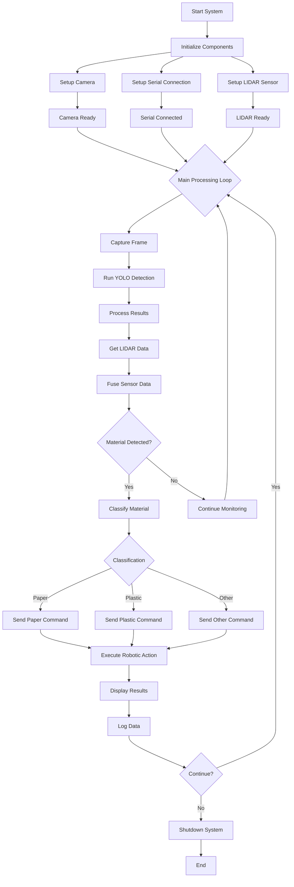
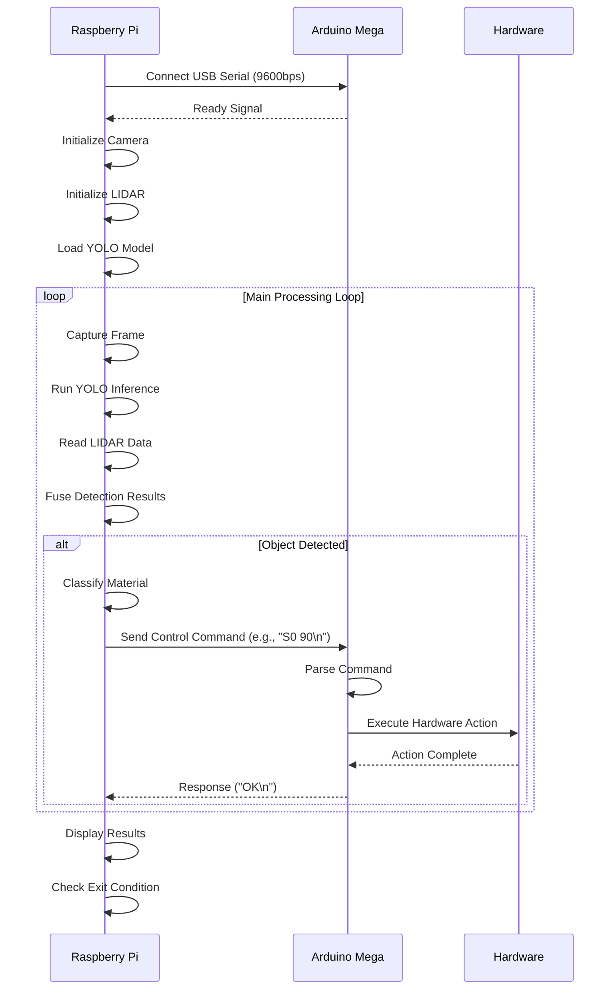

```mermaid
stateDiagram-v2
    [*] --> Initialization
    Initialization --> CameraSetup
    Initialization --> SerialSetup
    Initialization --> LIDARSetup

    CameraSetup --> Ready: Camera OK
    SerialSetup --> Ready: Serial OK
    LIDARSetup --> Ready: LIDAR OK

    Ready --> Processing: All Systems Ready

    state Processing as "Main Processing" as P
    P --> Detection: Capture Frame
    Detection --> Classification: Run YOLO
    Classification --> Fusion: Get LIDAR Data
    Fusion --> Decision: Analyze Results

    Decision --> Action: Object Found
    Decision --> Monitoring: No Object

    Action --> Command: Generate Command
    Command --> Execute: Send to Arduino
    Execute --> Response: Hardware Action
    Response --> Display: Update UI
    Display --> Processing

    Monitoring --> Processing

    Processing --> [*]: Exit Condition
```